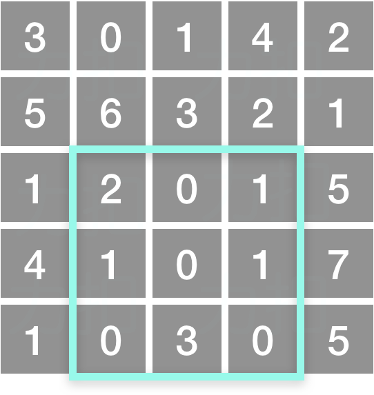
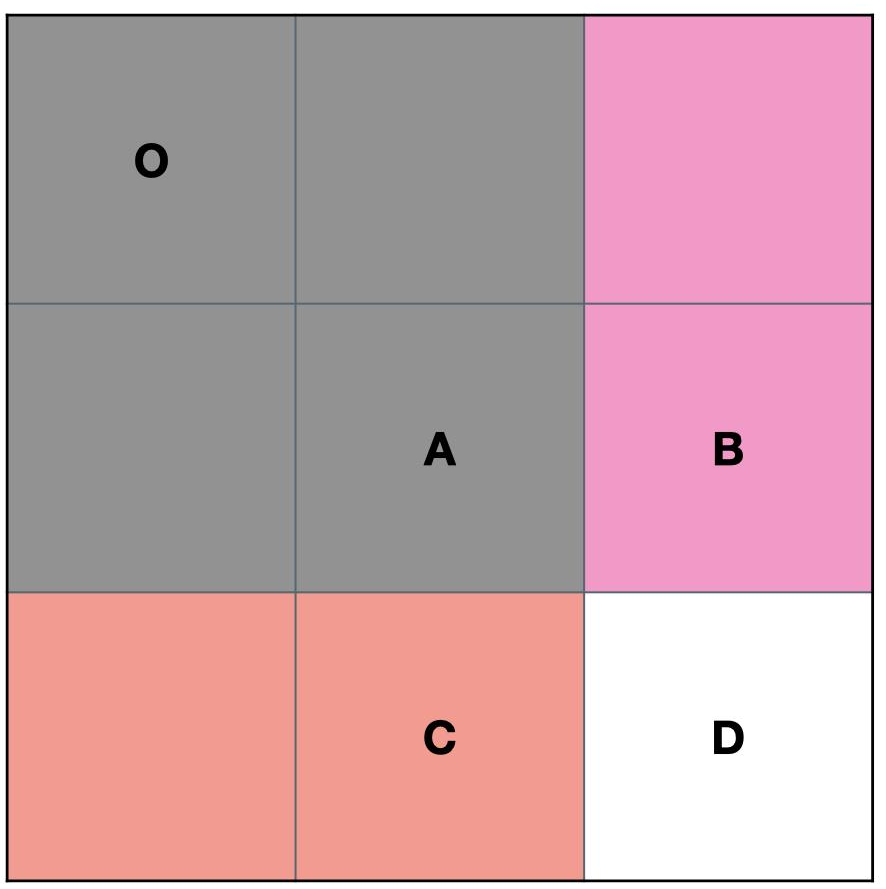

::: warning

给定一个二维矩阵，计算其子矩形范围内元素的总和

:::

<!-- more -->

## 题目描述

给定一个二维矩阵，计算其子矩形范围内元素的总和，该子矩阵的左上角为 (row1, col1) ，右下角为 (row2, col2) 。





上图子矩阵左上角 (row1, col1) = (2, 1) ，右下角(row2, col2) = (4, 3)，该子矩形内元素的总和为 8。


> [304. 二维区域和检索 - 矩阵不可变](https://leetcode-cn.com/problems/range-sum-query-2d-immutable/)

## 示例

```
给定 matrix = [
  [3, 0, 1, 4, 2],
  [5, 6, 3, 2, 1],
  [1, 2, 0, 1, 5],
  [4, 1, 0, 1, 7],
  [1, 0, 3, 0, 5]
]

sumRegion(2, 1, 4, 3) -> 8
sumRegion(1, 1, 2, 2) -> 11
sumRegion(1, 2, 2, 4) -> 12
```


## 提示

- 你可以假设矩阵不可变。

- 会多次调用 `sumRegion` 方法*。*

- 你可以假设 `row1 ≤ row2` 且 `col1 ≤ col2` 。

  

## 解法：容斥定理

```markdown
::: theorem 容斥定理
在[计数](https://baike.baidu.com/item/计数/9276342)时，必须注意没有重复，没有遗漏。为了使[重叠](https://baike.baidu.com/item/重叠/9009438)部分不被重复计算，人们研究出一种新的计数方法，这种方法的基本思想是：先不考虑重叠的情况，把包含于某内容中的所有对象的数目先计算出来，然后再把计数时重复计算的数目[排斥](https://baike.baidu.com/item/排斥/10717656)出去，使得计算的结果既无遗漏又无重复，这种计数的方法称为容斥原理。


::: right
来自 曹汝成．组合数学：华南理工大学出版社，2000年
:::
```

 根据容斥定理，可以得出子矩阵的面积公式。
$$
D = S(O, D)  - S(O, C) - S(O, B) + S(O, A) 
$$





实现代码如下：

```go
type NumMatrix struct {
    matrix_sum [][]int
}

func Constructor(matrix [][]int) (ret NumMatrix) {
    if len(matrix) == 0 || len(matrix[0]) == 0 {
        return
    }
    ret.matrix_sum = matrix
    length, width := len(matrix), len(matrix[0])
    for i := 0; i < length; i++ {
        pre_sum := 0    
        for j := 0; j < width; j++ {
            pre_sum += matrix[i][j]
            if i != 0 {
                ret.matrix_sum[i][j] = ret.matrix_sum[i - 1][j] + pre_sum
            } else {
                ret.matrix_sum[i][j] = pre_sum
            }
        }
    }
    return
}


func (this *NumMatrix) SumRegion(row1 int, col1 int, row2 int, col2 int) int {
    res := this.matrix_sum[row2][col2]
    if row1 > 0 {
        res -= this.matrix_sum[row1 - 1][col2]
    }
    if col1 > 0 {
        res -= this.matrix_sum[row2][col1 - 1]
    }
    if row1 > 0 && col1 > 0 {
        res += this.matrix_sum[row1 - 1][col1 - 1]
    }
    return res
}
```