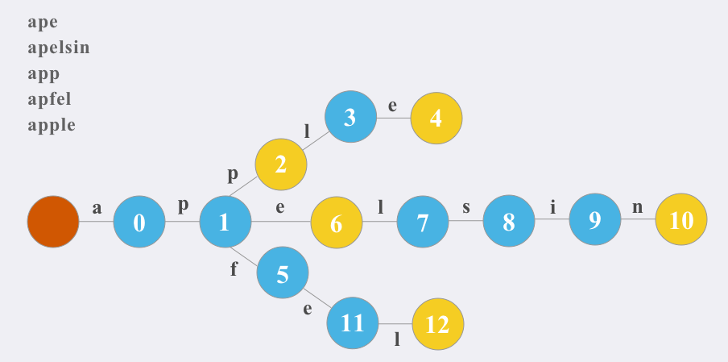

## 题目描述
> 来源：力扣（LeetCode）
> 链接：https://leetcode-cn.com/problems/implement-trie-prefix-tree

Trie（发音类似 "try"）或者说 前缀树 是一种树形数据结构，用于高效地存储和检索字符串数据集中的键。这一数据结构有相当多的应用情景，例如自动补完和拼写检查。

<!-- more -->

请你实现 Trie 类：

- `Trie()` 初始化前缀树对象。
- `void insert(String word)` 向前缀树中插入字符串 word 。
- `boolean search(String word)` 如果字符串 word 在前缀树中，返回 true（即，在检索之前已经插入）；否则，返回 false 。
- `boolean startsWith(String prefix)` 如果之前已经插入的字符串`word` 的前缀之一为 `prefix` ，返回 `true` ；否则，返回 `false` 。


## 示例：
```
输入
["Trie", "insert", "search", "search", "startsWith", "insert", "search"]
[[], ["apple"], ["apple"], ["app"], ["app"], ["app"], ["app"]]
输出
[null, null, true, false, true, null, true]

解释
Trie trie = new Trie();
trie.insert("apple");
trie.search("apple");   // 返回 True
trie.search("app");     // 返回 False
trie.startsWith("app"); // 返回 True
trie.insert("app");
trie.search("app");     // 返回 True
```

## 提示：

- 1 <= word.length, prefix.length <= 2000
- word 和 prefix 仅由小写英文字母组成
- insert、search 和 startsWith 调用次数 总计 不超过 3 * 104 次


## 思路


Trie，又称前缀树或字典树，是一棵有根树，其每个节点包含以下字段：

指向子节点的指针数组 `next_nodes`。

对于本题而言，数组长度为 26，即小写英文字母的数量。

此时 `next_nodes[0]` 对应小写字母 aa，`next_nodes[1]` 对应小写字母 bb，…，`next_nodes[25]` 对应小写字母 zz。

布尔字段 `is_leaf`，表示该节点是否为字符串的结尾。


```go
type TrieNode struct {
    is_leaf bool
    next_nodes [26](*TrieNode)
}
type Trie struct {
    root *TrieNode
}


/** Initialize your data structure here. */
func Constructor() Trie {
    return Trie{root: &TrieNode{is_leaf: false}}
}


/** Inserts a word into the trie. */
func (this *Trie) Insert(word string)  {
    node := this.root
    for _, ch := range word {
        if node.next_nodes[ch - 'a'] == nil {
            node.next_nodes[ch - 'a'] = &TrieNode{is_leaf: false}
        }
        node = node.next_nodes[ch - 'a']
    }
    node.is_leaf = true
}


/** Returns if the word is in the trie. */
func (this *Trie) Search(word string) bool {
    node := this.root
    for _, ch := range word {
        if node.next_nodes[ch - 'a'] == nil {
            return false
        }
        node = node.next_nodes[ch - 'a']
    }
    return node.is_leaf == true
}


/** Returns if there is any word in the trie that starts with the given prefix. */
func (this *Trie) StartsWith(prefix string) bool {
    node := this.root
    for _, ch := range prefix {
        if node.next_nodes[ch - 'a'] == nil {
            return false
        }
        node = node.next_nodes[ch - 'a']
    }
    return true
}


/**
 * Your Trie object will be instantiated and called as such:
 * obj := Constructor();
 * obj.Insert(word);
 * param_2 := obj.Search(word);
 * param_3 := obj.StartsWith(prefix);
 */
```
