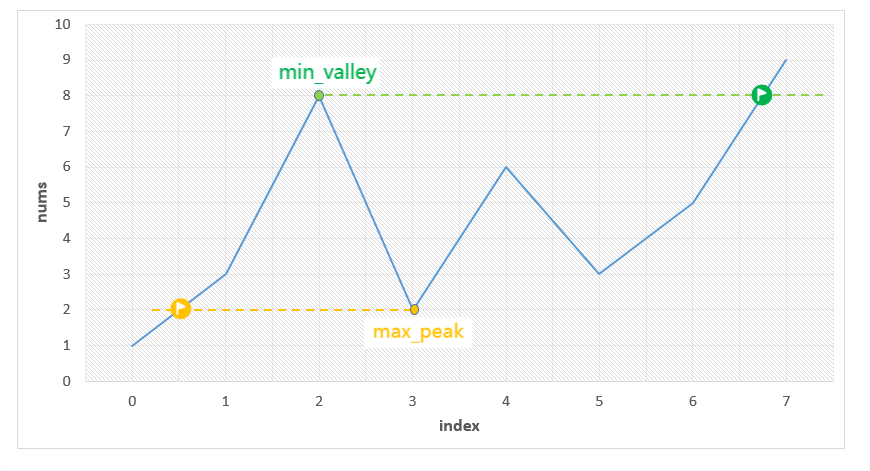

:::warning

请你找出符合题意的 最短 子数组，并输出它的长度。

:::

 <!-- more -->

## 题目描述


给你一个整数数组 `nums`，你需要找出一个 连续子数组 ，如果对这个子数组进行升序排序，那么整个数组都会变为升序排序。

请你找出符合题意的 最短 子数组，并输出它的长度。


> 来源：力扣（LeetCode）
> 链接：https://leetcode-cn.com/problems/shortest-unsorted-continuous-subarray/

## 示例
```
输入：nums = [2,6,4,8,10,9,15]
输出：5
解释：你只需要对 [6, 4, 8, 10, 9] 进行升序排序，那么整个表都会变为升序排序。

输入：nums = [1,2,3,4]
输出：0

输入：nums = [1]
输出：0
```

## 提示

- `1 <= nums.length <= 104`
- `-105 <= nums[i] <= 105`


## 解法1（单调栈）

| 时间复杂度 | 空间复杂度 |
| ---------- | ---------- |
| O(n)       | O(n)       |

单调栈的性质可以很好地检测不符合升序排序的元素。

单调栈元素包含值和索引，在出栈的时候可以更新乱序子数组开始的位置。

记录前序子数组中的最大值`preMax`，满足`nums[i] > preMax`才入栈，否则说明当前元素仍处于乱序子数组之中。

该方法解法类似这题： [无序数组中找到左侧比他小右侧比他大的数](www.guanyuqian.com/content/blogs/algorithm/ThePivotElements)


```go
func findUnsortedSubarray(nums []int) int {
    begin, end, preMax, mono_stk := len(nums), len(nums) - 1, nums[0], [][2]int{}
    for i, val := range nums {
        for len(mono_stk) != 0 && val < mono_stk[len(mono_stk) - 1][1] {
            if begin > mono_stk[len(mono_stk) - 1][0] {
                begin = mono_stk[len(mono_stk) - 1][0]
            }
            mono_stk = mono_stk[:len(mono_stk) - 1]
        }
        if val >= preMax {
            mono_stk = append(mono_stk, [2]int{i, val})
            preMax = val
        } else {
            end = i
        }
    }
    return end - begin + 1
}
```


## 解法2（贪心）

| 时间复杂度 | 空间复杂度 |
| ---------- | ---------- |
| O(n)       | O(1)       |

这个算法背后的思想是无序子数组中最小元素的正确位置可以决定左边界，最大元素的正确位置可以决定右边界。



首先，通过一次遍历我们需要找到最小的山谷值 `min_valley` 和最大的上峰值 `max_peak`。

然后，再遍历一次找到笔 `min_valley` 大的最前序和比 `max_peak`小的最后序。

```go
func findUnsortedSubarray(nums []int) int {
    n, min_valley, max_peak := len(nums), math.MaxInt32, math.MinInt32
    for i := range nums {
        if i != 0 && nums[i] < nums[i - 1] {
            if nums[i] < min_valley {
                min_valley = nums[i]
            }
            if nums[i - 1] > max_peak {
                max_peak = nums[i - 1]
            }
        }
    }
    begin, end := -1, -2
    for i:= 0; i < n && (begin == -1 || end == -2); i++ {
        if begin == -1 && nums[i] > min_valley {
            begin = i
        }
        if end == -2 && nums[n - i - 1] < max_peak {
            end = n - i - 1
        }
    }
    return end - begin + 1
}
```

