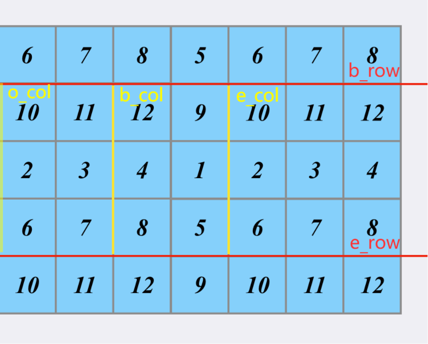

::: warning

找出并返回矩阵内部矩形区域的不超过 k 的最大数值和。

:::

<!-- more -->

## 题目描述

给你一个 m x n 的矩阵 matrix 和一个整数 k ，找出并返回矩阵内部矩形区域的不超过 k 的最大数值和。

题目数据保证总会存在一个数值和不超过 k 的矩形区域。


> [363. 矩形区域不超过 K 的最大数值和](https://leetcode-cn.com/problems/max-sum-of-rectangle-no-larger-than-k/)

#### 


## 示例


```
输入：matrix = [[1,0,1],[0,-2,3]], k = 2
输出：2
解释：蓝色边框圈出来的矩形区域 [[0, 1], [-2, 3]] 的数值和是 2，且 2 是不超过 k 的最大数字（k = 2）。
```


## 提示

- $m == matrix.length$
- $n == matrix[i].length$
- $1 \le m, n \le 100$
- $-100 \le matrix[i][j] \le 100$
- $-10^5 \le k \le 10^5$

## 解法

### 容斥定理

求二维矩阵的局域和，可以根据容斥定理。

本博客有过类似的题解，见[二维区域和检索 - 矩阵不可变](https://www.guanyuqian.com/content/Category/algorithm/SumRegion) 。

### 解法1： 暴力求解

- 时间复杂度：$\mathcal{O}(n^2 * m^2)$

- 空间复杂度：$\mathcal{O}(nm)$


利用容斥定理的求面积方法，枚举四条边即可，因为取值范围$1 \le m, n \le 100$，总数据量在$10^8$，小于$10^9$数据一般都可以运行通过。


```go
func maxSumSubmatrix(matrix [][]int, k int) int {
    for i := range matrix {
        pre_areas := 0
        for j := range matrix[i] {
            pre_areas = matrix[i][j] + pre_areas
            matrix[i][j] = pre_areas
            if i != 0 {
                matrix[i][j] += matrix[i - 1][j]
            }
        }
    }

    sumSubmatrix := func(bi, bj, ei, ej int) int {
        res := matrix[ei][ej]
        if bi > 0 && bj > 0 {
            res += matrix[bi - 1][bj - 1]
        }
        if bi > 0 {
            res -= matrix[bi - 1][ej]
        }
        if bj > 0 {
            res -= matrix[ei][bj - 1]
        }
        return  res
    }

    res := math.MinInt32
    for bi := 0; bi < len(matrix); bi++ {
        for bj := 0; bj < len(matrix[0]); bj++ {
            for ei := bi; ei < len(matrix); ei++ {
                for ej := bj; ej < len(matrix[0]); ej++ {
                    if area := sumSubmatrix(bi, bj, ei, ej); area <= k && area > res {
                        res = area
                    }
                }
            }
        }
    }
    
    return res
}
```


### 解法2：有序集合 + 二分查找

- 时间复杂度：$\mathcal{O}(n^2 * m log(m))$
- 空间复杂度：$\mathcal{O}(nm)$

在[不超过K的最大连续子数组和](https://www.guanyuqian.com/content/Category/algorithm/subarraySum2) 中，有一种思想是利用有序集合的方式来储存前缀和，然后通过二分查找来代替一个维度的遍历，提示效率。

这一题也可以利用这种思想，设子矩阵的上下两行为`b_row`与`e_row`，其左右设为`b_col`与`e_col`。假设在确定上下两行的情况下，矩形的面积可以表达为：
$$
area(b\_row,e\_row,b\_col,e\_col) =
area(b\_row,e\_row,o\_col,b\_col) - area(b\_row,e\_row,o\_col,e\_col)
$$



只要用一个有序集合维护所有$area(b\_row,e\_row,o\_col,b\_col)$，那么就可以用二分法加速查找符合要求的元素。

这里go实现的简易有序集合，参考本博客的[Go语言有序集合的简单实现](https://www.guanyuqian.com/content/Category/algorithm/orderSetOfGo)。

代码解法：

```go

func maxSumSubmatrix(matrix [][]int, k int) int {
    f
}


import (
	"math"
	"math/rand"
)
type node struct {
	ch       [2]*node
	priority int
	val      int
}

// 相等返回-1， 比b大返回0， 比b小返回1
func (o *node) cmp(b int) int {
	switch {
	case b < o.val:
		return 0
	case b > o.val:
		return 1
	default:
		return -1
	}
}

// 旋转根节点和子节点
func (o *node) rotate(d int) *node {
	x := o.ch[d^1]
	o.ch[d^1] = x.ch[d]
	x.ch[d] = o
	return x
}

type treap struct {
	root *node
}

// 把val插入以node为根的二叉搜索树，并且有一定概率对树进行旋转，返回插入后的根节点
func (t *treap) _put(o *node, val int) *node {
	if o == nil {
		return &node{priority: rand.Int(), val: val}
	}
	// 如果该值和当前节点不相等，则插入其子树中
	if d := o.cmp(val); d >= 0 {
		o.ch[d] = t._put(o.ch[d], val)
		if o.ch[d].priority > o.priority {
			o = o.rotate(d ^ 1)
		}
	}
	return o
}

func (t *treap) put(val int) {
	t.root = t._put(t.root, val)
}

// 找到比集合中val小的最大值
func (t *treap) lowerBound(val int) (lb *node) {
	for o := t.root; o != nil; {
		switch c := o.cmp(val); {
		case c == 0:
			lb = o
			o = o.ch[0]
		case c > 0:
			o = o.ch[1]
		default:
			return o
		}
	}
	return
}

```

