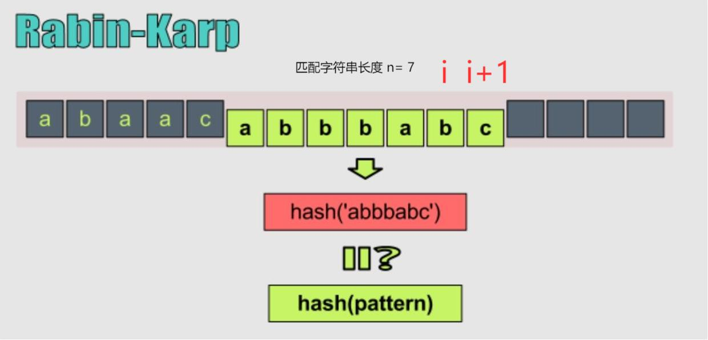

::: warning

给你两个字符串 `haystack` 和 `needle` ，请你在 `haystack` 字符串中找出 `needle` 字符串出现的第一个位置（下标从 0 开始）。

:::

<!-- more -->

## 题目描述

实现 strStr() 函数。

给你两个字符串 haystack 和 needle ，请你在 haystack 字符串中找出 needle 字符串出现的第一个位置（下标从 0 开始）。如果不存在，则返回  -1 。

 

> 来源：力扣（LeetCode）
> 链接：https://leetcode-cn.com/problems/implement-strstr

当 needle 是空字符串时，我们应当返回什么值呢？这是一个在面试中很好的问题。

对于本题而言，当 needle 是空字符串时我们应当返回 0 。这与 C 语言的 strstr() 以及 Java 的 indexOf() 定义相符。

## 示例

```
输入：haystack = "hello", needle = "ll"
输出：2

输入：haystack = "aaaaa", needle = "bba"
输出：-1

输入：haystack = "", needle = ""
输出：0
```

## 提示

- `0 <= haystack.length, needle.length <= 5 * 104`

- `haystack` 和 `needle` 仅由小写英文字符组成

  

## 解法

### 解法1：Rabin-Karp(字符串哈希)


Rabin-Karp算法是由M.O.Rabin和R.A.Karp发明的一种基于散列的字符串查找算法。
Rabin_karp算法的思想是通过将字符串的比较转回成数字的比较。比较两个长度为m的字符串是否相等需要O(m)时间，而比较两个数字是否相等通常可以是O(1)。为了将字符串映射称对应的数字，需要用到哈希函数。

1. **哈希函数** ，定义$ch_i$为字符串的第`i`位字符对应的索引值，可简单取$ch_i - 'a'$。`base`不同位字符串的基数，一般`base`会定义为比字符数量大的素数， `Hash(i)` 就是前`i` 个字符的哈希值。

$$
Hash(i)=(ch_1×base^{i−1}+ch_2×base^{i- 2}+……+ch_n×base^{0})
$$

2. **取模**，因为采用`base`进制，这里要考虑到字符串过长带来的溢出问题，定义`mod`为取模值，一般`mod`会定义为大素数。**这里需要特别注意，哈希函数取模很容易弄错，所以公式不能轻易改变。**

$$
Hash(i)=
\begin{cases}
ch_i×base^{0}& \text{i == 0}\\
(Hash(i - 1)×base^{i - 1} + ch_i×base^{0}) \% mod & \text{otherwise}\\
\end{cases}
$$

3. **更新哈希**根据上述公式，再较长的字符串中可以采用滑动窗口的思想更新不同位置子串的哈希值。比如匹配字符串长度为`n`，结尾位置从`i`更新到了`i+1`。

$$
Hash(i + 1) =((Hash(i) - ch_{i - n + 1} * base^{n - 1}) * base + ch_{i + 1}) \% mod
$$



4. **解决冲突**，由于我们采用了取模的方式，所以有可能出现哈希冲突。**当两个哈希值相等时，还需要遍历比较一下是否相等**。


实现代码如下：


```go
func strStr(haystack string, needle string) int {
	n := len(needle)
	if n == 0 {
		return 0
	}
	const base, mod = 29, 100000000000+9
	hash1, hash2, highest := 0, 0, 1

	for i := range haystack {
		if i < n {
			hash1 = (hash1 * base + (int)(haystack[i] - 'a')) % mod
			hash2 = (hash2 * base + (int)(needle[i] - 'a')) % mod
			if i == n - 1 {
				if (hash1 == hash2) && equal(haystack[i - n + 1 : i + 1], needle) {
					return i - n + 1
				}
			} else {
				highest = (highest * base) % mod
			}
		} else {
			hash1 = (base * (hash1 - (int)(haystack[i - n] - 'a') * highest) + (int)(haystack[i] - 'a')) % mod
			if (hash1 == hash2) && equal(haystack[i - n + 1 : i + 1], needle) {
				return i - n + 1
			}
		}
	}
	return -1
}

func equal(str1, str2 string) bool {
	for i := range(str1) {
		if str1[i] != str2[i] {
			return false
		}
	}
	return true
}
```


### 解法2：KMP(最长公共前后缀)


KMP算法理解起来十分困难，并且网络上对KMP算法的细节设定不一样，导致看起多个博客来十分凌乱，在此次做几个关键的定义。

1. **KMP算法的本质**，就是记录模式串每个位置的最长公共前后缀信息，当匹配失败的时候就可以跳过一些匹配位置。

   

```go
for i, j := 0, 0; i < len(haystack); i++ {
	for j > 0 && haystack[i] != needle[j] {
    j = lcps[j - 1]
    }
    if haystack[i] == needle[j] {
    	if j == n - 1{
    	return i - n + 1
    	}
    	j++
    }
}
```


1. **最长公共前后缀数组**，设`lcps[]`为模式串的最长公共前后缀数组，性质为：`lcps[i] => neddle[:lcps[i]] ==  neddle[i - lcps[i] + 1:] `。

| 模式串         | A    | B    | A    | A    | B    | A    | B    | A    | B    | A    | A    |
| -------------- | ---- | ---- | ---- | ---- | ---- | ---- | ---- | ---- | ---- | ---- | ---- |
| 最长公共前后缀 | 0    | 0    | 1    | 1    | 2    | 3    | 0    | 1    | 2    | 3    | 4    |


```go
for i, j := 1, 0; i < n; i++ {
	for j > 0 && needle[i] != needle[j] {
        // 找到前一个比较位置
		j = lcps[j - 1]
	}
	if needle[i] == needle[j] {
		j++
		lcps[i] = j
	}
}
```


实现代码：

```go
func strStr(haystack string, needle string) int {
    n := len(needle)
    if n == 0 {
        return 0
    }

    lcps := make([]int, len(needle))
    for i, j := 1, 0; i < n; i++ {
        for j > 0 && needle[i] != needle[j] {
            j = lcps[j - 1]
        }
        if needle[i] == needle[j] {
            j++
            lcps[i] = j
        }
    }

    for i, j := 0, 0; i < len(haystack); i++ {
        for j > 0 && haystack[i] != needle[j] {
            j = lcps[j - 1]
        }
        if haystack[i] == needle[j] {
            if j == n - 1{
                return i - n + 1
            }
            j++
        }
    }
    
    return -1
}
```

