::: warning
关于Redis 5设计、数据结构、底层命令实现，以及持久化、主从复制、集群的实现。
:::

<!-- more -->

## 第一章 引言

**为什么Redis的性能高：**

1. 内存：因为Redis是基于内存的存储数据库。
2. 单线程：Redis使用单线程来处理网络请求，避免了不必要的上下文切换与线程同步的操作。
3. 并发：使用I/O多路复用，可以高效处理大量并发连接
4. 数据结构：Redis中的数据结构经过特殊设计，确保操作的高效性

**Redis的优点：**

1. 运行速度快：基于内存的数据库、单线程 IO多路复用
2. 支持复杂数据结构：支持字符串、链表、集合、散列表、有序列表等数据结构
3. 支持数据持久化：可以采用RDB、AOF、RDB&AOF三种方案，计算机重启后可以在磁盘中进行数据恢复
4. 支持主从结构：可以使用从实例进行数据备份
5. 操作具有原子性：所有 Redis 操作都是原子操作，这确保如果两个客户端并发访问，Redis 服务器能接收更新的值。
6. 多实用工具： Redis 是一个多实用工具，可用于多种用例，如：缓存，消息队列(Redis 本地支持发布/订阅)，应用程序中的任何短期数据，例如，web应用程序中的会话，网页命中计数等。

## 第二章 简单动态字符串 

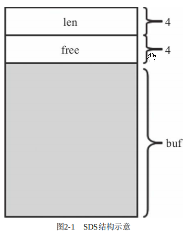

​	**SDS优点**

- 二进制安全：Redis的SDS是二进制安全的，通过柔型数组（统计长度、空间）来实现SDS，而不是转义符'\0'。

- 自适应多类型节约空间：分成5种类型，不同结构之间记录长度和空间的变量大小不同的头的大小不一样，Redis可以根据SDS长度自动为其选择不同的数据结构

- - sdshdr5：2^5字节以内字符串，耗费1字节的头来记录
  - sdshdr8：2^8字节以内字符串，耗费2字节+3位的头来记录
  - sdshdr16：2^16字节以内字符串，耗费4字节+3位的头来记录
  - sdshdr32：2^32字节以内字符串，耗费8字节+3位的头来记录
  - sdshdr64：2^64字节以内字符串，耗费16字节+3位的头来记录

**SDS API**

- **创建字符串：**Redis通过sdsnewlen函数创建SDS。在函数中会根据字符串长度选择合适的类型，初始化完相应的统计值后，返回指向字符串内容的指针。
- **释放字符串：**SDS除了提供释放内存的释放方法，还提供清空状态头的释放方法来优化性能。
- **拼接字符串：**拼接两个字符串，如果长度不够就会自动扩容和选择合适的数据结构存储新的值。
- **其他APU：**读操作的复杂度多为O(1)，直接读取成员变量；涉及修改的写操作，则可能会触发扩容。

**SDD 扩容规则(sdsMakeroomFor)**

SDS在涉及字符串修改处会调用sdsMakeroomFor函数进行检查，类似c++的vector，

- 请求长度<1MB的，扩容两倍。
- 请求长度>1MB的，扩容1MB。

**其他**

- sdshdr5字符串进行扩容，会自动升级为sdshdr8以上的字符串。因为sdshrd5字符串的机构和其他字符串不一样。
- 创建空字符串，会默认创建sdshdr8类型的字符串，而不是sdshrd5.

## 第三章 跳跃表

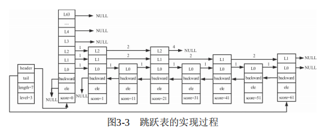

跳跃表是Redis有序集合的一种实现方式，特点是平均操作效率接近红黑树O(logN)，但实现比红黑树简单。

**跳跃表组成**

- 由很多层有序链表构成，高层有序链表是底层有序链表的子集（最底层有序链表包含所有节点）

- 跳跃表节点包含键、值、后退指针、前进指针层数组

- - 节点的层高为前进指针层数组的长度，是随机生成的（层数越高概率越小）
  - 前进指针层由前进指针（forward）和跳过的节点个数(span)组成

- 跳跃表有一个头节点，头节点中有一个64层的指针结构

- 跳跃表结构包含头节点指针、尾节点指针、层高、长度

- - 头节点指针（head）：头节点中有一个64层的指针结构
  - 尾节点指针（tail）：尾节点为最底层链表的最后一个节点
  - 层高（level）：最高层非头节点的值
  - 长度（length）：最底层链表的长度

**Redis有序集合实现**

- Redis有序集合有跳跃表和压缩列表两种实现方式，底层自动转换用户层无感。
- 一般默认采用压缩列表进行实现，当值的长度或者元素个数超过压缩列表的限制就转换成跳跃表，且此过程不可逆。

## 第四章 压缩列表

Redis的有序集合、散列和列表都直接或者间接采用了压缩列表。

压缩列表ziplist本质上是一个柔性数组的数组，每个entry数据都是一个柔性数组，和sds类似。

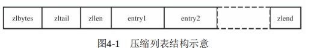

压缩列表以时间换空间，把所有的数据压缩在一块连续的内存区域中。

压缩列表的增删操作与数组类似，都涉及到内存重新分配和连续数据拷贝。

可用使用LZF等压缩算法来对ziplist的内容进行进一步的压缩。

**压缩列表数据结构**

- zlbytes（长度）
- zltail（尾元素相对于起始地址的偏移量）
- zllen（元素个数）
- entryX（压缩元素）

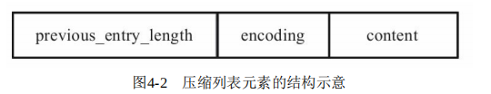

- zlend（结尾占位符）

**连锁更新问题**，压缩列表中每个元素会在开头记录前一个元素的长度previos_entry_length，该尺寸为1字节或5字节。对压缩列表进行删除或者添加有可能造成后续一系列元素的previos_entry_length尺寸的改变，Redis通过在更新结束后判断后续元素的previos_entry_length字段是否改变来进行连锁更新。

## 第五章 字典

字典又称散列表，Redis字典具有以下特点：

- 支持值为 String、Hash、List、Set、SortedSet的散列表。

- 采用链地址法来解决Hash冲突

- 字典结构中存在两张Hash表指针，

- - 初始均执行NULL，
  - 正常情况一张指向NULL，另一张执行Hash表实例，
  - Rehash情况下两张均指向Hash表实例，且一大一小相差两倍

- **扩容和缩容：**字典结构支持扩容和缩容，采取渐进式Rehash策略

- **遍历：**支持全遍历和简短遍历

- - **全遍历：**一次命令执行就遍历完整个数据库。

  - - 普通迭代器，使用期间不能操作字典，因为会引起rehash导致遍历重复
    - 安全迭代器，使用期间允许操作字典，通过锁rehash来保证遍历不重复

  - **间断遍历：**每次命令执行只取部分数据，分多次遍历，不锁rehash

  - - 采用reverse binary iteration的方法来避免期间出现的rehash造成的遍历错误
    - 如果在两部分间断遍历期间完成了多次rehash，可能会造成遍历错误，但是这种情况极少发生，所以没有做特殊处理。

## 第六章 整数集合

整数集合属于集合的一种，是Redis的一种基本数据结构，用户无感。

- **使用场景：**当集合被创建时只有整数，且数量有限时（默认512个以内），Redis使用整数集合存储。如果插入其他类型数据或者数量过多集合则转变为hashtable结构进行存储。
- **数据结构：**本质上是有序的动态整数数组，分成16位、32位和64位三种类型。
- **操作：**查找、添加、删除操作，因为是有序数组，使用二分查找法加速查找。添加操作可能会插入超出当前整数集合规格的值，此时会进行自动升级。但是没发现Redix有对删除集合后进行自动降级的操作。

## 第七章 快速列表

Redis3.2之前的列表实现方式：Redis采用ziplist和双向链表来实现列表的。压缩列表ziplist有省空间的特点，但是过长的数据会导致操作效率的降低，就使用双向链表adlist进行处理。

Redis3.2之后的列表采用快速列表quicklist进行实现，快速列表是ziplist和adlist的结合数据结构，最外层是adlist，其中的节点是ziplist。快速列表支持压缩算法对数据进行进一步的压缩。

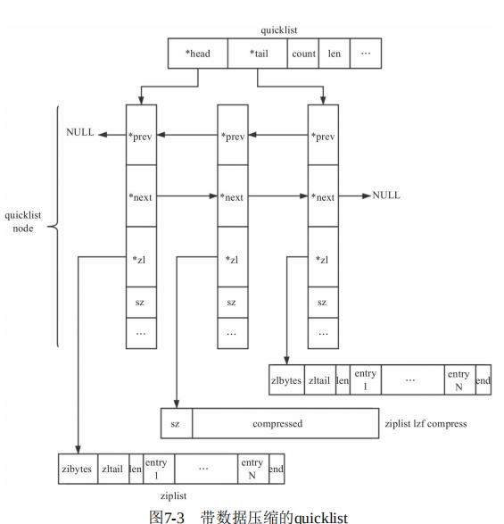

快速列表的增删改查操作就是对具体的每个节点的ziplist进行的增删改查。

- 对于增加：对中间某个已满的节点进行插入操作会导致此节点（假设此节点为 node）的 ziplist 在插入点进行分裂，此时这个 ziplist 会变成两个 ziplist（新建一个 quicklistNode 保存多出来的 ziplist，假设此节点为 newnode），然后将数据插入 node 指向的 ziplist 的末尾，然后对 node 进行 _quicklistMergeNodes 的尝试合并操作。
- 对于删除：提供单个删除和连续删除两个操作，连续删除操作可能会跨节点执行。
- 对于修改：修改会执行删除和增加操作，而不会直接执行修改，因为涉及到ziplist的空间变化问题。

## 第八章 Stream

Redis在5.0版本引入了**消息队列**的实现，即Stream组件。

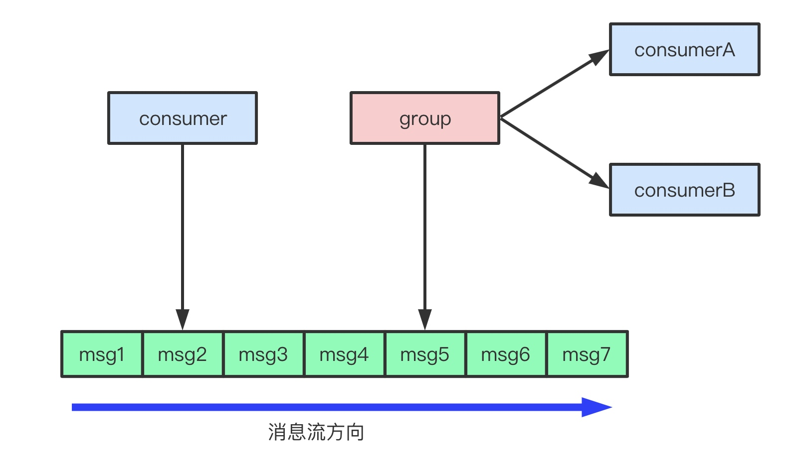

Redis之前实现pub/sub模式，但是不实用，故设计Stream。Stream的优势在于：

- 支持异步传输，消费者不需要立处理消息。
- 支持消息持久化，Redis宕机了仍然可以处理消息。

Stream的设计特点如下：

- 由消费者、消费组、消息、消息队列构成。

- **消息**类似字典（哈希），由多组field-value组成。每个消息有唯一的消息ID，消息ID严格递增。通过listpack和steamNACK进行包装。

- **消息队列**按提交顺序持久化存储最新（设置的存储上限）的消息。通过Rax树实现。

- **消费者**可以属于某个消费组。也可以不依赖消费组，可以将不依赖消费组的消费者简单理解为只有一个消费组的消费者，这类消费者在下文用消费组进行概括。

- **消费组**可以有多个消费者，它们是竞争关系，也就是说一个消息只能由该组的一个消费者消费。消费组都可以消费该消息队列的全部消息，多个消费组之间相互独立。

- - last delivered id：**消费组**每个消费组有记录访问过的消息索引。
  - streamNACK：**消费组**未确认消息，记录未确认消息的发送时间、消费者等数据。
  - pending entry list，pel：**消费组**都会维护已访问但是没有被确认的消息。通过Rax树实现。

Stream应用到的特殊数据结构：

- listpack：批量存储消息，Stream用消息包（listpack）结构体存储消息，listpack中包含多个消息（entryX)，并且按照一定的规则对它们进行了压缩。

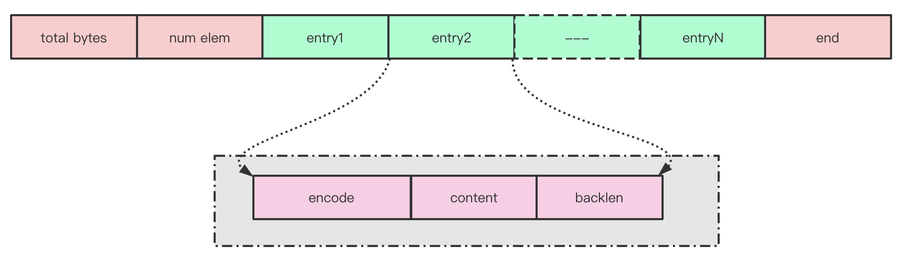

- rax：rax是基数树（压缩前缀树）

- - stream的消息队列：以消息ID为key，listpack为value，listpack中包含多条消息，因为消息ID是严格递增的，所以key应该是listpack中的第一条消息的ID。
  - 消费组的pel：以消息ID为key，streamNACK为value。

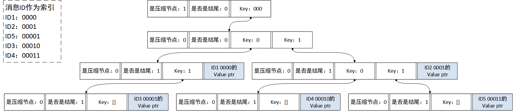

## 第九章 命令处理生命周期

Redis是CS架构，其服务器属于典型的事件驱动程序。

Redis服务器中的重要结构体有：对象结构体、客户端结构体、服务端结构体、命令结构体、事件结构体等。

**客户端结构体client**

Redis服务器使用client来维护所有与之连接的客户端信息。

包括ID、socket、client对应的数据库实例、待执行客户端命令、待返回值等。

**服务端结构体redisServer**

Redis服务器用redisServer维护自身的相关信息。

包括端口、命令表、客户端列表以及其他配置参数。

**命令结构体redisCommand**

redis把所有可执行的命令用redisCommand维护

**对象结构体robj**

- **robj是key-value数据库中的value：**存储Redis中的key-value对，key只能是字符串，value为对象结构体robj，可以是字符串、列表、集合、有序集合和散列表，这5种数据类型。

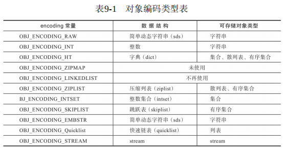

- **每种数据类型有多重实现方式：**每种数据类型可以有多种不同的实现方式，这些实现方式是根据数据类型的变化而自动改变的。

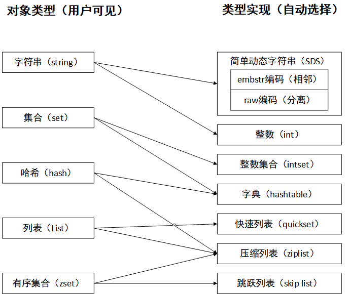

- **引用计数：**通过refcount引用计数方法，可以实现对象共享。
- **LRU策略：**在robj结构体中增加lru辅助字段，实现对对象的LRU缓存淘汰策略。

- **编码类型：**raw编码是redis的常用编码，字符串的SDS还有embstr编码

- - **raw编码：**先申请对象结构体robj的内存，然后再申请实现结构体的内存，通过robj中的指针指向结构体内存。

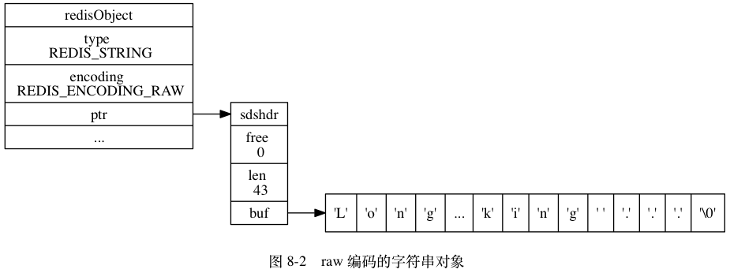

- - **embstr编码：**当sds比较小时（比如sdshdr8），即可采用embstr编码将sds和robj相邻存储，将两次内存分配（robj、sds）缩短为一次（robj+sds）。

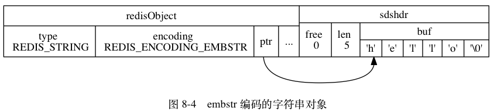

**事件处理**

- Redis是事件驱动程序，Redis通过事件处理函数（aeEventLoop）处理所有事件。

- Redis的事件分为文件事件和事件事件。

- - 时间事件：定时任务，这类任务相对固定，比如清除异常客户端连接、删除过期数据等。Redis只有一个时间事件，在该事件中再对各种任务进行处理，这个过程类似OS的时钟中断。为了避免任务执行事件过长，时间事件中的任务往往会有执行时间的约束，不全是一次完成。
  - 文件事件：基于TCP协议的socket读写相关任务，比如处理和客户端的连接、响应客户端的命令。通过对I/O多路复用的封装，Redis得以在单线程中同时监听多个socket。每次监听socket都会有超时时间，确保在下次时间事件到来之前Redis不会处于监听文件事件的阻塞状态。

**Server的启动过程**

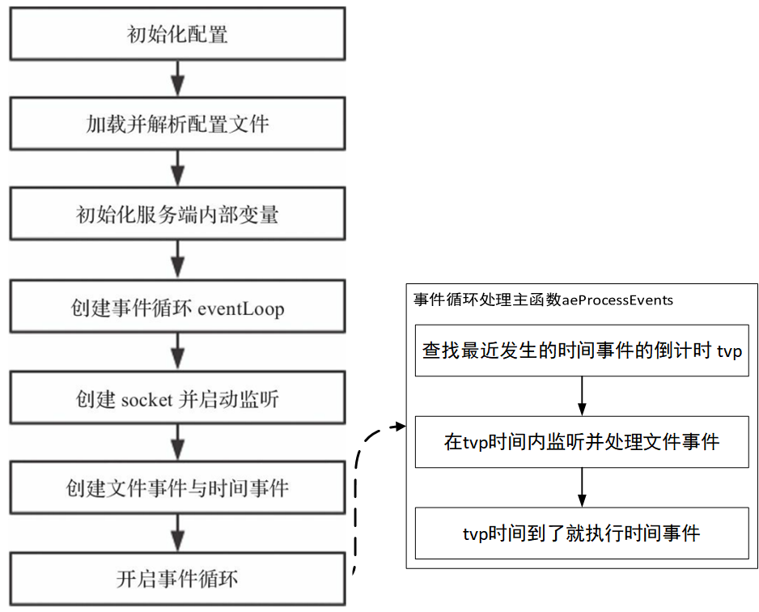

**命令处理过程**

处理命令发生在响应文件任务期间，通过TCP进行数据传输。

TCP协议会出现半包和沾包问题，

- Redis通过自定义传输格式的功能识别TCP的数据包。
- 在客户端client结构中会存储待解析的命令相关信息，解决半包和粘包造成的命令不全问题。

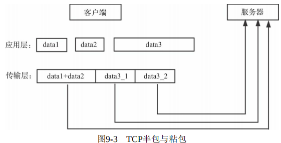

命令处理过程的流程图如下

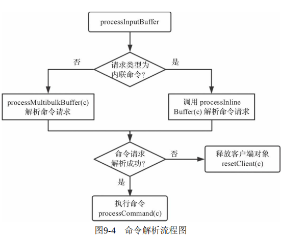

Redis服务端将待返回的结构存储在客户端的输出缓存区或者输出链表中，随着TCP协议打包返回给客户端。这个过程发生在每次等待文件事件之前的beforesleep函数中。由于返回结果可能会很大，不能一次全部发送给客户端，所以需要通过添加返回结果的写文件事件，通过写文件事件来执行未在beforesleep函数中完成的结果返回任务。

## 第十章 键相关命令

两个重要的结构体redisObject和redisDb

- redisObject：是前面介绍的robj对象，它的结构如下。

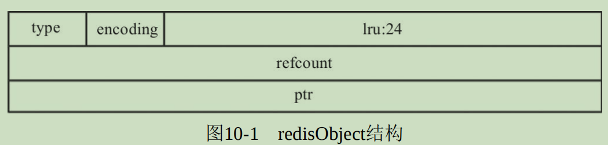

- redisDB：Redis对数据库的封装，用来管理数据库相关数据和操作。

查看键信息相关命令：

- object：查看键属性
- type：查看键类型
- ttl：查看键过期时间

设置键信息相关命令：

- expire：设置键过期时间
- persist：删除键过期时间
- rename：重命名键
- touch：更新键访问时间

查找键相关命令：

- exist：查询键是否存在
- keys：阻塞查找符合要求的键
- scan：异步遍历键（有可能会造成信息重复）
- randomkey：随机返回键

操作键相关命令：

- del：阻塞删除键
- unlink：自动选择阻塞同步删除或者非阻塞异步删除键（另一个线程中执行）
- dump：系列化键
- restore：反序列化键
- move：移动键到另一个数据库，在集群模式下不能使用
- migrate：将键迁移到另一个Redis实例中
- sort：对键进行排序（内部用块排）

## 第十一章 字符串相关命令

设置字符串：

- set：set命令用于将key-value设置到数据库。可以指定覆盖规则和过期时间
- mset：批量设置字符串
- 

修改字符串：

- append：直接改变底层value的值，不是用set重新覆盖
- setrange：设置value的部分子串
- 计数器：Redis中数字（int、float）的对象类型是string，通过调用incr/decr/incrby/decrby/incrbyfloat这五个命令，可以对他们进行计数操作。

获取字符串：

- get：get命令用于获取key的值，当key不存在时，返回NIL，当key存在时，返回查找到的结果。
- getset：更新键对应的值，并返回旧的值。
- getrange：获取字符串部分子串
- strlen：获取值字符串长度
- mget：获取多个key的值

位操作字符串：

- setbit：设置指定偏移量上的比特位

- getbit：获取指定偏移量上的比特位

- bitpos：返回指定偏移后的第一个设置为bit值的索引值

- bitcount：统计指定值比特值为1的数量，有多种实现方法

- - 遍历每一位
  - n= n & (n - 1)
  - variable-precision swar算法
  - Redis的实现：查表法+variable-precision swar算法

- bitop：对一个或多个key执行元操作

- bitfield：将字符串当成一个二进制数组，并对这个字节数组第offset位开始进行获取、设置、增加值等。

## 第十二章 散列表相关命令

散列表是Redis提供的5种类型之一，底层通过ziplist或者hashtable。

当key和value的尺寸长度都不长且元素不多时，采用ziplist进行存储。

否则采用hashtable存储。

存在由ziplist想hashtable的转化，但是不存在从hashtable转回ziplist。

相关命令：

- 设置（hset、hmset、hsetnx）
- 读取（hexists、hget、hmget、hkeys、hvals、hgetall、hlen、hscan）
- 删除（hdel）
- 自增（值为数值类型时，可以进行自增操作，hincrby、hincrbyfloat）

## 第十三章 列表相关命令

列表的底层结构是quicklist、在第七章中进行介绍。quicklist是双向链表和ziplist的结合。

相关命令：

- 堆栈命令，值得注意的是列表有阻塞操作，即BLPOP和BRPOP，如果没有成功，则请求的客户端会被放入redisDb的阻塞字典中，待阻塞超时或者满足的资源被提供时才被唤醒。

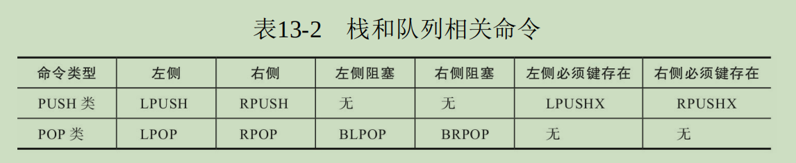

- 获取列表数据：lindex、lrange、llen
- 操作命令：lset、linsert、lrem、ltrim

## 第十四章 集合相关命令

集合的底层结构是intset和dict。

单个集合相关命令：

- sadd：添加新成员，涉及到集合底层结构的转换和hashtable的扩容
- srem：删除成员
- srandmember：随机获取一个或多个成员
- spop：随机弹出一个或多个成员，弹出多个成员时如果弹出过多则会更改底层hashtable
- sismember：查找元素是否在集合中
- smove：移动指定元素到另一个集合中
- scard：获取集合中元素个数
- sscan：遍历集合元素

多个集合运算命令：

- sinter：交集（安装某个集合规则进行排序，以最小集合元素为基本从大到小进行遍历）
- sinterstore：交集，保存至指定集合
- sunion：并集
- sdiff：差集

## 第十五章 有序集合相关命令

有序集合有两种实现方式：

- ziplist：如果数据较少或者数据长度不是很长
- dict + skiplist：在单个元素的定位使用dict来让复杂度降到O(1)

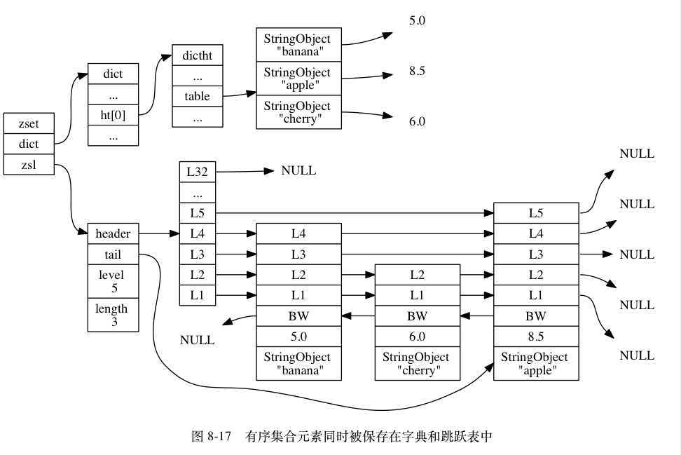

有序集合的值会有score和member两个参数，分布代表排序相关的分数和值

相关命令有：zadd、zrem、zcard、zcount、zincrby、zrank、zrevrank、zscore、zscan、zrange、zrevrange、zrangebyscore、zrevrangebyscore、zrangebylex、zlexcount、zremrangebyrank、zremrangebyscore、zremrangebylex、zunionstore、zinterstore。

## 第十六章GEO相关命令

geohash是在2008年公开的位置处理算法，能将二维的经纬度信息进行降维存储和计算。

相关知识：z阶曲线&geohash算法

- z阶曲线把二维标拼接用二进制进行存储，对二进制进行Base32编码可以节约存储空间。

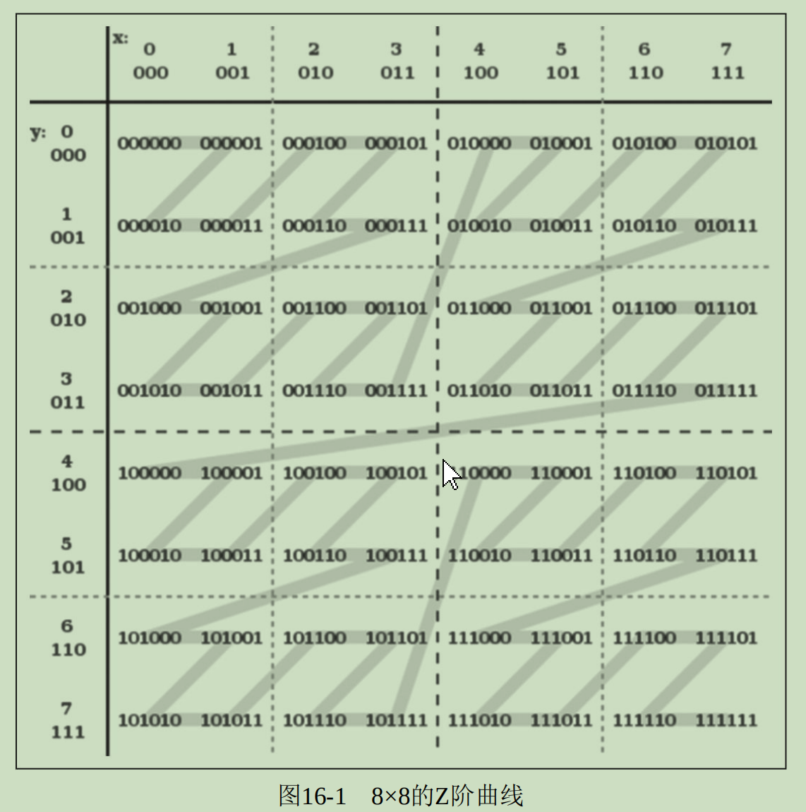

- geohash算法的相关操作

- - 存储地址的经纬度坐标（按照z阶曲线进行Base32编码存储）
  - 返回地址的经纬度坐标（将信息解码），由于涉及到精度问题，返回的值和存入的值不完全一致
  - 计算两点坐标距离
  - 查找指定坐标范围内的其他坐标：通过遍历计算，O（N）复杂度

Redis通过集合存储地点的GEO信息。

## 第十七章 HyperLog相关命令

对大基数内容进行统计的时候，使用set、bitmap存储可以获得高精度的解决方案，但是需要大量的空间。

Redis使用HLL（超对数计数算法），降低一定的精度来解决基数计数问题。

## 第十八章 数据流相关命令

Redis 5.0.0引入了Stream，本章主要介绍Stream相关命令的底层实现。

相关命令：xadd、xrange、xrevrange、xdel、xgroup、xreadgroup、xread、xack、xclaim、xinfo、xtrim、xlen。

## 第十九章 其他命令

**事务**

Redis提供事务机制，开启事务后，接下来的命令将会入队而不是直接执行。

在事务执行过程中，Redis不会执行其他命令，重启古城镇加载AOF文件也能包装事务命令的完整性。

保障数据不会被篡改，Redis使用乐观锁机制，提供watch命令监听事务中重要的key，如果执行事务的时候这些key没有被修改才能成功执行事务。

**发布订阅模式**

相比于Stream来说，发布订阅模式不支持持久化和异步传输。

**Lua脚本**

支持运行Lua代码

## 第二十章 持久化

Redis是一个内存数据库，执行持久化时会生成子线程来完成持久化操作，支持三种持久化方案：

- RDB，生成某个时间点前的快照。优点：恢复快，缺点：丢失数据多
- AOF，保持某个时间段Redis服务器的每一条命令。有点：丢失数据少，缺点：恢复慢
- RDB与AOF混合，保持某个时间点前的RDB，在执行RDB期间的命令用AOF保持，结合两者优点

## 第二十一章 主从复制

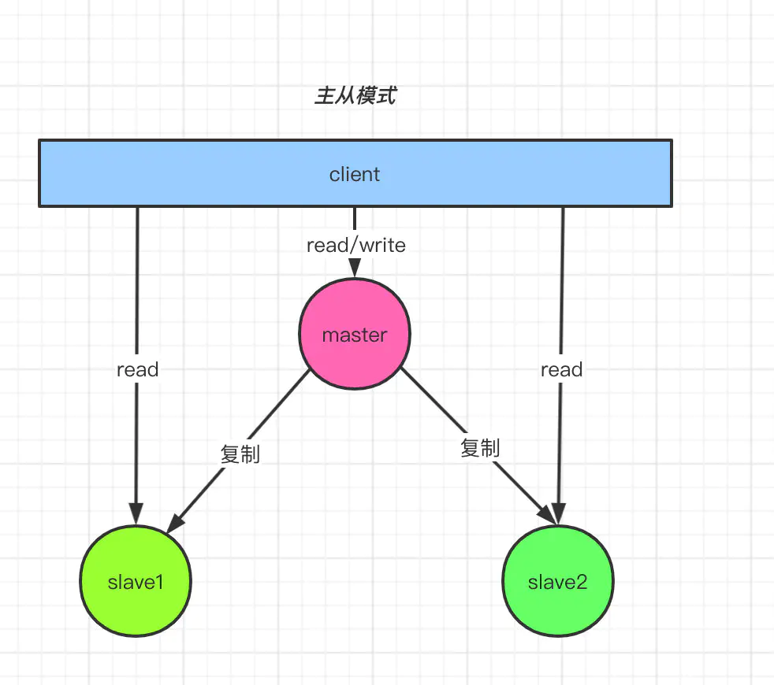

主从复制的最基础应用是主从模式，区别于Redis的单机模式，这里列举一下单机模式的优缺点

优点：

1. 部署简单
2. 成本低，不需要多服务器支持
3. 低访问量下高性能，不涉及到数据同步问题，在访问量不超过资源上限的情况下性能较高

缺点：

1. 可靠性差，单机运行有宕机风险
2. 高访问量下低性能，受限于单机算力与带宽限制，高访问量下处理资源能力跟不上
3. 很难实现在线扩容和扩充资源

主从模式的优缺点

优点：

1. 读写分离，主服务器负责处理写命令，从服务器们负责处理读命令和持久化操作，他们之间再进行同步，这样可以提升Redis的服务能力。
2. 数据容灾，（主从模式 是哨兵模式和集群模式的基础）主服务器宕机了，可以让从服务器升级为主服务器，提升Redis的稳定性。（应用在哨兵模式或者集群模式下）

缺点：

1. 不支持自动升级主服务器（在哨兵模式和集群模式下解决）
2. 所有写命令都需要在主节点上执行，同样会面临和单机模式一样的高访问量下低性能问题
3. 同步服务器数据消耗额外资源
4. 比较难实现在线扩容和扩充资源

主服务器响应主从复制的两种方式

1. 完全同步：RDB快照+RDB快照后的命令缓存
2. 部分同步：RDB快照后的部分命令缓存

选择执行主从复制的流程

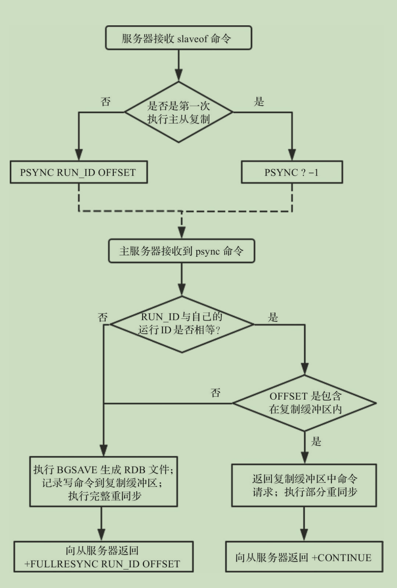

提升主从复制效率：

1. 从服务器通过持久化主从复制信息来提升主从复制速度，防止关闭重启后从新复制之前的信息
2. 主服务宕机了，从服务器进行升级为主服务器时，会存储主服务器的复制信息，响应其他服务器的主从复制命令

## 第二十二章 哨兵和集群

哨兵模式：基于主从模式，哨兵模式增加了一个或多个哨兵服务器组成哨兵系统，哨兵系统可以监视所有数据服务器的运行状态，如果检测主服务器运行出现问题，可以重新选择从服务升级为主服务器。

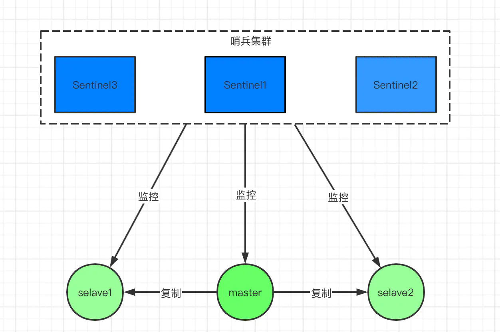

优点：

1. 基于主从模式，具有主从模式的所有优点

2. 1. 读写分离
   2. 数据容灾

3. 自动选择主服务器，可用性更强

缺点：

1. 比较难实现在线扩容和扩充资源
2. 需要保存数据同步

Sentinel的工作方式:

1)：每个Sentinel以每秒钟一次的频率向它所知的Master，Slave以及其他 Sentinel 实例发送一个 PING 命令 

2)：如果一个实例（instance）距离最后一次有效回复 PING 命令的时间超过 down-after-milliseconds 选项所指定的值， 则这个实例会被 Sentinel 标记为主观下线。 

3)：如果一个Master被标记为主观下线，则正在监视这个Master的所有 Sentinel 要以每秒一次的频率确认Master的确进入了主观下线状态。 

4)：当有足够数量的 Sentinel（大于等于配置文件指定的值）在指定的时间范围内确认Master的确进入了主观下线状态， 则Master会被标记为客观下线 

5)：在一般情况下， 每个 Sentinel 会以每 10 秒一次的频率向它已知的所有Master，Slave发送 INFO 命令 

6)：当Master被 Sentinel 标记为客观下线时，Sentinel 向下线的 Master 的所有 Slave 发送 INFO 命令的频率会从 10 秒一次改为每秒一次 

7)：若没有足够数量的 Sentinel 同意 Master 已经下线， Master 的客观下线状态就会被移除。 

若 Master 重新向 Sentinel 的 PING 命令返回有效回复， Master 的主观下线状态就会被移除。

集群模式：通过数据分片的方式，让不同的主从服务群能够处理不同的数据，以突破单一主服务器性能限制。

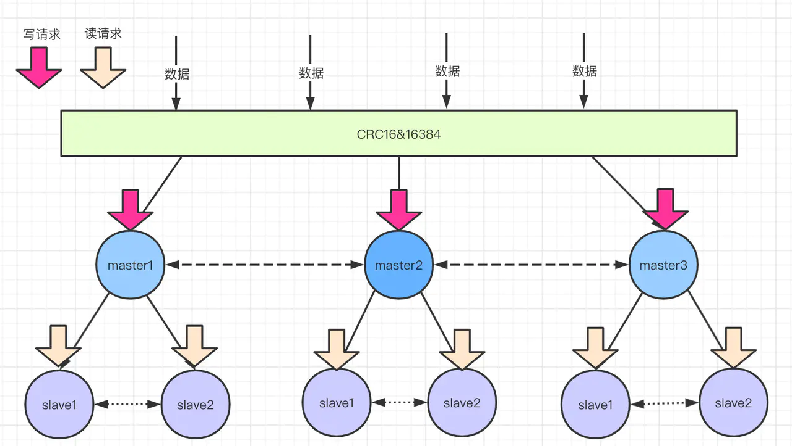

优点：

1. 基于哨兵模式，具有哨兵模式的所有优点

- 1. 读写分离
  2. 数据容灾
  3. 自动选择主服务器

1. 支持在线扩容（添加主从服务器群）
2. 支持共享从服务器(副本漂移）

缺点：

1. 需要保存数据同步