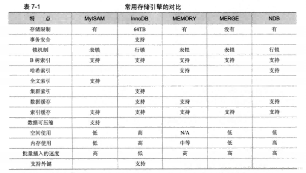
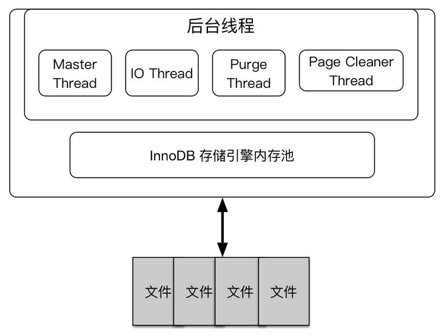

::: warning

　基于MySQL 5.6，结合源代码，从存储引擎内核角度对InnoDB的整体架构、核心实现和工作机制进行深入剖析。

:::

<!-- more -->

## 第1章 MySQL体系结构和存储引擎

### 数据库和实例
- 数据库 ：物理操作系统文件或其他形式类型文件的集合
- 实例 ： MySQL数据库由后台线程以及一个共享内存区组成。Mysql数据库实例在系统上的表现就是一个进程

### MySQL体系结构
- 连接池组件
- 管理服务和工具组件
- SQL接口组件
- 查询分析器组件
- 优化器组件
- 缓冲组件
- 插件式的存储引擎
- 物理组件


###  MySQL存储引擎
MySQL与其他数据库的区别之一就是插件式的存储引擎。每个存储引起都有各自特点，能够根据具体应用建立不用的存储引擎表。

特别需要注意的是，存储引擎是基于表的，而不是数据库，每张表可以采用不一样的存储引擎。



#### MyISAM
MyISAM不支持事务、采用表锁设计，支持全文索引，由MYD(MYData，存储数据)，MYI(MYIndex，存储索引)。主要面向一些OLAP（在线分析处理）数据库应用。是MySQL 5.5.8前的默认存储引擎。

#### InnoDB
InnoDB存储引擎支持事务、采用行锁设计、支持外键和非锁定读（默认读取操作不会产生锁），使用MVCC（多版本并发控制）来获得高并发性，并且实现了SQL标准的4中隔离级别，默认为REPEATABLE（可重复读）从MySQL 5.5.8后成为默认存储引擎。


### 连接MySQL
连接MySQL本质上是一个客户端进程想MySQL服务端进程（数据库实例）进行通信的操作。
本质上是进程间通信，MySQL支持的几种连接方式如下：
- TCP/IP：网络连接，跨平台
- 命名管道和共享内存：采用Windows平台提供的进程间通信方式
- UNIX域套接字：Linux和UNIX环境下，支持套接字进行本机通信。

## 第2章 InnoDB存储引擎

### InnoDB存储引擎体系架构
- InnoDB是**多线程模型**，后台具有多个线程负责处理不同的任务。
- InnoDB是**基于磁盘存储**的，利用内存池缓存技术可以提高运行效率。



#### 后台线程
InnoDB的后台线程可以分为四类

- Master Thread：主线程主要负责将缓冲池中的数据异步刷新到磁盘中。
- IO Thread：输入输出线程主要负责使用AIO（Async IO）技术来处理IO请求。又分为读线程(多个)、写线程(多个)、插入缓存线程(单个)和日志线程(单个)四类。
- Purge Thread：清除线程主要负责回收已使用过的undo页，原来的版本中这个功能是在Master Thread中完成，可配置多个清除线程来提高页回收效率。
- Page Cleaner Thread：页面清除线程作用是脏页的刷新操作，原来的版本中这个功能是在Master Thread中完成。

#### 内存池
内存池主要分为缓存池、重做日志缓存和额外缓存池三个部分。


##### 缓存池

缓存池的空间主要用来存储数据页、索引页，即加速热数据的相关操作。此外还被用来存储插入缓存、锁信息、数据字典信息和自适应哈希索引等。在现在的InnoDB版本中，可配置多个缓存池。


缓存池中的管理对象的最小单位是页（默认16k），缓存池中的管理对象可以被归类为三种：Free List、LRU List和Flush List。

- Free List：用以存放空闲页
- LRU List：缓存池通过midpoint insertion strategy（中点插入策略）的LRU算法来对页进行管理。即制定一个中点（midpoint），中点前的数据被才为热数据。在每次更新数据之时会将新数据插入LRU List的中点后而不是LRU List的前端。在该页被持续访问一段时间（innodb_old_blocks_time）后才将其加入LRU List的前端，改过程称为page made young。
- Flush List：LRU List中的页被修改后，改页即变为脏页，意味着内存中该页的数据和磁盘中该页的数据不一致。缓存池就会将这一页记录到Flush List中，再通过CHECKPOINT（检查点）机制完成同步。

现版本的InnoDB支持压缩页功能，即支持管理1K、2K、4K和8K的页，借助伙伴算法进行页内存的分配。

##### 重做日志缓存

InnoDB内存池有一部分为重做日志缓存，即把重做日志的信息放入到这个缓冲区，之后在下列几种情况再将其写入磁盘变为重做日志：

- Master Thread 每秒都会将重做日志缓存刷新为重做日志。
- 每个事物提交时会将重做日志缓存刷新为重做日志。
- 当重做日志缓存空间低于1/2时，会将重做日志缓存刷新为重做日志。

##### 额外内存池

可以理解为内存堆， 负责对一些额外的数据结构的内存进行分配。


### CheckPoint技术

CheckPoint（检查点）技术负责将内存的脏页同步到磁盘中，分为两类：
- Sharp Checkpoint：将全部脏页都写入磁盘，在数据库关闭时如果进行了相关配置（innodb_fast_shutdown = 1）就会触发。
- Fuzzy Checkpoint：将部分脏页写入磁盘，不会造成宕机效果，在InnoDB中又有四种情况会触发Fuzzy Checkpoint：
    - Master Thread Checkpoint：主线程每秒或每十秒就会从Flush List中的脏页写入磁盘
    - FLUSH_LRU_LIST Checkpoint：清除线程负责处理当LRU List的页长期没被命中被换出时，将其中的脏页写入磁盘
    - Async/Sync Flush Checkpoint：清除线程负责当重做日志文件的空间快被用完时，从Flush List中的脏页写入磁盘
    - Dirty Page too much：当Flush List中的脏页过多时就会将部分脏页写入磁盘


### Master Thread工作方式

InnoDB的主要工作是在主线程中完成的，不同版本的主线程工作内容不全一致，但是大致工作都是：

- 将日志缓存到磁盘，即使事务还没提交
- 合并更改缓存（change buffer：insert buffer、delete buffer、purge buffer）
- 将脏页写回磁盘

### InnoDB关键特性

InnoDB的关键特性包括：插入缓存、两次写、自适应哈希索引、异步IO、刷新邻接页。这些特为InnoDB带来更好的性能。


#### 插入缓存（insert buffer）

对于非聚集索引的插入或者更新操作，InnoDB不是每一次都直接插入到索引页中，而是先判断插入的索引页是否在缓存池中，如果在则直接插入，如果不在则放入Insert Buffer中，之后再异步进行插入操作。因为这样会使同一索引页的多次插入操作可以聚集在同一时间点完成。

可以执行insert buffer操作的索引需要满足两个条件：

- 索引是辅助索引（secondary index）
- 索引不是唯一索引

在现在的版本中，插入缓存被扩充成了更改缓存，即支持插入缓存、删除缓存和更新缓存三种索引缓存操作，使用B+树管理所有更改缓存，这就可以让所有更改缓存安装索引聚合在一起，方便之后的异步合并操作。

合并更改缓存的时机可分为以下三种：

- 辅助索引页被读取到缓存池时，将B+树中对应的更改缓存合并入改辅助索引页中。
- 辅助索引页空间不足时（insert buffer bitmap负责记录辅助索引页的空间是否充足），将B+树中对应的更改缓存合并入改辅助索引页中。
- Master thread定期随机执行

#### 两次写（doublewrite）


为了防止写入磁盘时发送意外宕机而导致的重做日志无法恢复的情况，InnoDB在对缓冲池的脏数据进行刷盘的时候，并不会直接写到磁盘中，而是先将数据复制到内存中的doublewrite的缓存中，之后通过缓存，再分两次，每次1MB的写入共享表空间的物理磁盘上，完事儿之后然后立马同步磁盘。

这样，一份数据就在磁盘上有两个副本。在上面的过程中，从数据页往内存中的doublewrite缓冲中写入数据是顺序的，相对来讲比较快，而从内存中的doublewrite落盘时候是离散的IO，相对来讲比较慢。

如果在写入磁盘的时候出现了问题，innodb将会在共享表空间的doublewrite中找到该数据页的一个副本，将其复制到表空间文件，再应用重做日志，也就是redo log。

#### 自适应哈希（AHI， Adaptive Hash Index）

InnoDB会对表中各索引页进行该观察，如果建立哈希索引可以带来速度的提升则建立哈希索引。

#### 异步IO

read ahead、脏页写回等操作都由AIO完成。

InnoDB支持在windows和linux上执行真实的异步IO操作。在其他系统下只能用程序模拟。

#### 刷新邻接页

在使用机械硬盘记录数据时，可以采用刷新邻接页功能提升效率，即在进行脏页写回操作时检测邻接页是否也是脏页，如果是则一同写回。


#### 启动、关闭与恢复

InnoDB支持对相应参数的配置以调整数据库启动关闭与恢复的性能。

- innodb_fast_shutdown：通过修改关机时脏页的写回情况调整开关机时间。
- innodb_force_recovery：可调整存储引擎的恢复策略。


## 第3章 文件

主要包括参数文件、日志文件、socket文件、pid文件、MySQL表结构文件、存储引擎文件。

### 参数文件

当MySQL实例启动时，会先去读一个配置文件。参数类型有动态参数和静态参数。动态参数意味着你可以在MySQL实例运行中进行更改，静态参数则反之。通过SET命令可对动态参数值进行修改。其中global关键字表示该参数修改是基于整个实例的生命周期，session表示会话期

### 日志文件

- **错误日志：**错误日志对MySQLde 启动、运行、关闭过程进行了记录，不但记录了出错信息，同时也记录了些警告信息或者正确的信息。
- **慢查询日志：**可以设定一个阈值，将运行时间超过（非等于）该值得所有SQL语句都记录到慢查询日志中。
- **二进制日志：**二进制日志记录了对数据更改的所有操作，只是更改，所以SELECT、SHOW之类的操作不在范围之类

### 套接字文件

```shell
show variables like ‘socket’\G
```

linux环境建立套接字链接时产生的文件

### pid文件

```shell
show variables like ‘pid_file’\G
```


linux环境进程产生会生成pid文件记录进程信息

### 表结构定义文件

不管使用什么存储引擎，MySQL都会有一个以frm为后缀名名的文件，这个文件记录了该表的表结构定义

### InnoDB存储引擎文件

包括重做日志文件和表空间文件

- **重做日志文件：**默认情况下会有两个重做日志文件，ib_logfile0和ib_logfile1.它们记录了对于InnoDB存储引擎的事务日志。可以根据需要添加更多的重做日志文件。
- **表空间文件：**InnoDB中，存储的数据按表空间进行存放。默认配置下，会有一个初始化大小为10M的名为ibdata1的文件。


## 第4章 表

### 索引组织表

InnoDB中，表都是安装主键的顺序组织存放，这种存放方式称为**索引组织表**。

选择主键的规则：

- 明确定义主键时选则明确定义的列
- 未明确定义时，选择**第一个定义**（和建表时列的声明顺序无关，）的**非空唯一**索引作为主键。

对于**单一列**作为主键的表，可以用`_rowid`变量读取主键。

### InnoDB逻辑存储结构

InnoDB中所有数据都被存储在表空间(tablespace)中。表空间又由段(segment)、区(extent)、页(page)组成。


#### 表空间

InnoDB存储引擎有一个共享表空间`ibadta1`，存储信息（所有表的数据、索引、插入缓存Bitmap页、回滚信息、插入缓冲索引页、系统事务信息、二次写缓冲）。

用户可以通过配置，将每张表的数据、索引、插入缓存Bitmap页存到独立的表空间中，其他信息还是存放在共享表空间中。

共享表空间中的数据并不会因为独立表的删除而减小，而是将不可用的数据进行标记，存储未来的有效数据。

#### 段

表空间是由各种段组成的，其中数据段为B+树的叶子节点，索引段为B+树的索引节点。


#### 区

区是由连续页组成的空间，默认1M大小。


#### 页

页是InnoDB磁盘管理的最小单位，默认16KB大小。


### InnoDB行记录格式

InnoDB以行的形式存储数据，每一页中保存着表中的一行行数据。

InnoDB的行存储格式分为Compact和Redundant。Compact为InnoDB的默认行存储格式，Redindant为兼容格式。

#### Compact行记录格式

未完待续（......）


## 第5章 索引与算法

### InnoDB索引

分成三种：

- B+树索引：B+树索引不能找到一个给定键值得具体行，智能找到被查找行数据所在的页，然后把页读入内存，再从内存中进行查找。
- 全文索引
- 哈希索引：第3章提过，哈希索引是自适应建立的，不能人为干预

### 数据结构与算法

二分查找、二叉查找数、平衡二叉树、B+树

### B+树索引

#### 聚集索引

- 叶子节点存放具体数据：聚集索引按照每张表的主键构造一颗B+树，同时叶子节点存放整张表的行记录数据。
- 每张表唯一：每张表只能有一个聚集索引。
- 页之间逻辑有序：聚集索引中所有页不在物理地址上连续，而是通过双向链表进行连接达到逻辑上有序排列。
- 排序和范围查找速度快：由于B+树特性，聚集索引对于主键的排序查找和范围查找速度非常快。

#### 辅助索引（非聚集索引）

- 叶子节点存放聚集索引键值：查找一个非聚集索引的数据，需要在辅助索引B+树和聚集索引B+树中进行两次查找
- 每张表可存在多个

### B+树索引的使用

#### 适合建立索引的情况

并不是所有的列都适合建立索引，一般的经验是每个索引对应表中很少的数据时才有意义。

Cardinality是一个预估值，判断该列是否适合建立索引。

#### OLTP与OLAP应用

OLTP应用需要大量的精确查询操作，适合建立B+树索引

OLAP应用需要大量的多数据访问操作，部适合建立B+树索引

#### 联合索引

联合索引是指对表上多个列进行索引。联合索引的B+树中的值是由多个列组成的，每个值之间进行了排序。

#### 覆盖索引

InnoDB支持覆盖索引，即辅助索引的值中包含了主键信息，因此查询主键中的某个信息可以直接由辅助索引直接得到，而不需要再从聚集索引中查找。

#### 强制使用索引查找

优化器选择的查询路径不一定是最优的，可以使用FORCE INDEX来强制使用某个索引进行查询。

### 哈希

- 哈希算法：InnoDB使用哈希算法对字典进行查找，使用链表法解决冲突。
- 自适应哈希索引：InnoDB支持自适应哈希索引，自动对数据库中的表格进行建立索引。
- 全文检索：InnoDB1.3后支持全文检索技术，通过搜索索引的部分内容查询得到相关数据。


## 第6章 锁

| 数据库/引擎         | 描述                                 |
| ------------------- | ------------------------------------ |
| MyISAM              | 表锁                                 |
| InooDB              | 一致性非锁定读（MVCC）、行锁、意向所 |
| SQL Server 2005以前 | 页锁                                 |
| SQL server 2005以后 | 乐观行锁、悲观表锁                   |

### Latch与Lock：

- Latch，一般指线程级别的锁，比如互斥量（mutex）、读写锁等。
- Lock，一般指数据库中的锁。

### InnoDB的锁

#### 锁的类型

InnoDB的锁分为四种粒度：数据库锁、表锁、页锁、行锁。

又分为意向锁和锁两者类型，如果想对某一粒度对象加锁，必须对改对象更粗的粒度对象加意向锁。

锁的兼容性表如下所示，本质是如果同时获取锁可能会让数据收到影响，则不兼容。

|                  | IS，读意向锁 | IX，写意向锁 | S，读锁 | X，写锁 |
| ---------------- | ------------ | ------------ | ------- | ------- |
| **IS，读意向锁** | 兼容         | 兼容         | 兼容    | 不兼容  |
| **IX，写意向锁** | 兼容         | 兼容         | 不兼容  | 不兼容  |
| **S，读锁**      | 兼容         | 不兼容       | 兼容    | 不兼容  |
| **X，写锁**      | 不兼容       | 不兼容       | 不兼容  | 不兼容  |

#### 一致性非锁定读(MVCC)

InnoDB通过使用多版本并发控制（Multi Version Concurrency Control, MVCC）的方式提供了一致性非读锁。

如果想要读取的数据上锁了，可以读取它的历史快照。

而对于不同的隔离级别，MVCC的具体处理方式又有所不同。

- 读提交（READ COMMITTED)：读取提交后的数据，对于并发事务，读取历史快照数据，但是并发事务提交后读取的就是更新的数据。
- 重复读（REPEATETABLE READ）：在一次事务中读取数据相同，不管并发事务是否对数据进行了更改，读取的仍然是快照中的数据。


#### 自增长的锁处理

由于InnoDB支持行锁，所以会有自增长冲突问题。即，

- 如何保证自增长键不会相等——采用锁机制
- 同一事务中的自增长键是否连续

InnoDB提供两种方式：

- 同一事务中的自增长键一定连续（表锁）
- 同一事务中的自增长键不一定连续（行锁）

#### 外键的锁处理

对于外键，InnoDB不会使用一致性非锁定读，因为这会造成数据不一致。


### 锁的算法

InnoDB中采用三种锁算法：

- Record Lock：**读提交隔离级别默认使用**单个行记录上的锁
- Gap Lock：间隙锁，一个范围的锁，但不包含记录本身。
- Next-Key Lock（解决幻读问题 Phantom Problem）： **可重复度隔离级别默认使用**Record Lock + Gap Lock，包含一个范围与记录本身的锁。


#### 幻读问题 Phantom Problem

幻读问题是指在同一事务下，连续执行两次SQL语句可能导致不同的结果，**第二次的SQL语句可能会返回之前不存在的行**。

::: tip

这里与可重复读的区别在于，可重复读关注某个数据是否发生变化，幻读关注数据总量是否发生增长。

:::

InnoDB采用Next-Key Lock解决幻读问题。因为Next-Key Lock不只锁定查询到的值，还锁定了查询的范围，保证同一事务中两次查询的数据量不会发生改变。


### 锁问题

锁问题可以对应几种不同的隔离级别，隔离级别越高，锁解决的问题越多，并发性能也越差。

- 丢失更新（Missing Update）： 写、写并行，一个事务对数据的更新操作被另外数据覆盖。实际上InnoDB所有隔离级别均不会导致该问题，但是对于更上层的多用户环境可能会间接导致这一错误。可以在数据库指令中明确使用锁来解决。

- 脏读（Dirty Read）： 读-写并行，一个事务读到另一个事务**修改过但未提交**的数据。
- 不可重复读（Non-Repeatable Read）：读-写并行， 一个事务读到另一个事务**提交了**的数据，这会导致同一次事务中多次读取数据的结果不同。
- 幻读（Phantom）： 读-写并行，一个事务根据**某些条件**查询到了另一个事务**提交了新增或删除的**的**符合条件**的一些数据，这回导致同一次事务中多次范围查询得到的数据量不同。**即使保证了可重复读，只能保证原先查询的数据不被改变，但是不能保证查询范围内不会新增数据**

| 隔离级别     | 丢失更新 | 脏读 | 不可重复读 | 幻读 |
| ------------ | -------- | ---- | ---------- | ---- |
| **读未提交** | 避免     | 可能 | 可能       | 可能 |
| **读提交**   | 避免     | 避免 | 可能       | 可能 |
| **可重复度** | 避免     | 避免 | 避免       | 可能 |
| **序列化**   | 避免     | 避免 | 避免       | 避免 |


### 死锁

**死锁是指两个或两个以上的事务再执行过程中，因争夺资源而导致的的一种互相等待的现象。**

再非序列化的并发情况，就可能导致死锁。

InnoDB中处理死锁有两种方法：

- （死锁解决）超时机制
- （死锁避免）等待图（wait-for graph），利用图结构记录所有锁信息，检测是否存在回路。


### 锁升级（Lock Escalation）

**锁升级是指将当前锁的粒度降低**。比如把1000个行锁升级为一个页锁。

**SQL Server中**，行锁根据每次记录而产生，锁对于数据库来说是一种稀有资源，通过锁升级能够减少数据库中锁的数量，提升处理性能。

InnoDB不存在锁升级的问题，因为它不是根据每个记录来产生行锁的，而是根据每个事务访问的每个页来对锁进行管理，采用位图的方式。因此不管一个事务中锁住页中的一个记录还是多个记录，其开销通常都是一致的。