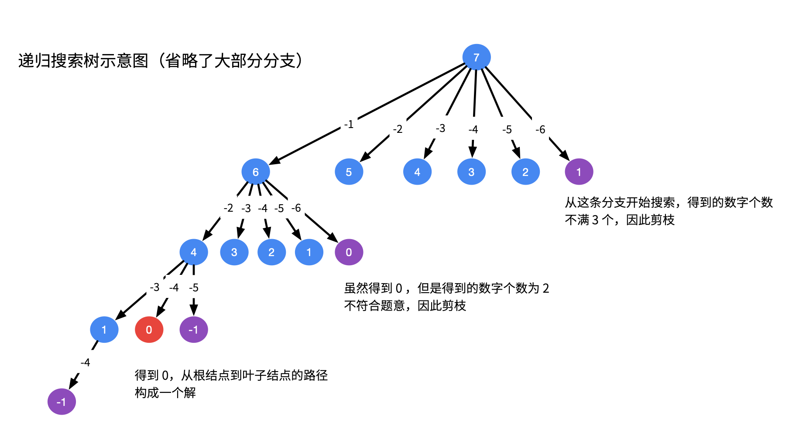

::: warning

找出 `candidates` 中所有可以使数字和为 `target` 的组合。

:::

<!-- more -->

## 题目描述

### 组合总和 Ⅰ

给定一个无重复元素的数组 candidates 和一个目标数 target ，找出 candidates 中所有可以使数字和为 target 的组合。

candidates 中的数字可以无限制重复被选取。

**说明**：

- 所有数字（包括 `target`）都是正整数。
- 解集不能包含重复的组合。 

> [39. 组合总和](https://leetcode-cn.com/problems/combination-sum/)

#### 示例

```
输入：candidates = [2,3,6,7], target = 7,
所求解集为：
[
  [7],
  [2,2,3]
]

输入：candidates = [2,3,5], target = 8,
所求解集为：
[
  [2,2,2,2],
  [2,3,3],
  [3,5]
]
```

#### 提示

- `1 <= candidates.length <= 30`
- `1 <= candidates[i] <= 200`
- `candidate` 中的每个元素都是独一无二的。
- `1 <= target <= 500`


### 组合总和 Ⅱ

给定一个数组 candidates 和一个目标数 target ，找出 candidates 中所有可以使数字和为 target 的组合。

candidates 中的每个数字在每个组合中只能使用一次。

**说明**：

- 所有数字（包括目标数）都是正整数。
- 解集不能包含重复的组合。 


> [40. 组合总和 II](https://leetcode-cn.com/problems/combination-sum-ii/)

#### 示例

```
输入: candidates = [10,1,2,7,6,1,5], target = 8,
所求解集为:
[
  [1, 7],
  [1, 2, 5],
  [2, 6],
  [1, 1, 6]
]

输入: candidates = [2,5,2,1,2], target = 5,
所求解集为:
[
  [1,2,2],
  [5]
]
```


### 组合总和 Ⅲ

找出所有相加之和为 n 的 k 个数的组合。组合中只允许含有 1 - 9 的正整数，并且每种组合中不存在重复的数字。

**说明**：

- 所有数字都是正整数。
- 解集不能包含重复的组合。 


> [216. 组合总和 III](https://leetcode-cn.com/problems/combination-sum-iii/)

#### 示例

```
输入: k = 3, n = 7
输出: [[1,2,4]]

输入: k = 3, n = 9
输出: [[1,2,6], [1,3,5], [2,3,4]]
```


### 组合总和 Ⅳ

给你一个由 不同 整数组成的数组 nums ，和一个目标整数 target 。请你从 nums 中找出并返回总和为 target 的元素组合的个数。

题目数据保证答案符合 32 位整数范围。

[377. 组合总和 Ⅳ](https://leetcode-cn.com/problems/combination-sum-iv/)

#### 示例

```
输入：nums = [1,2,3], target = 4
输出：7
解释：
所有可能的组合为：
(1, 1, 1, 1)
(1, 1, 2)
(1, 2, 1)
(1, 3)
(2, 1, 1)
(2, 2)
(3, 1)
请注意，顺序不同的序列被视作不同的组合。
```

#### 提示

- `1 <= nums.length <= 200`
- `1 <= nums[i] <= 1000`
- `nums` 中的所有元素 **互不相同**
- `1 <= target <= 1000`

**进阶：**如果给定的数组中含有负数会发生什么？问题会产生何种变化？如果允许负数出现，需要向题目中添加哪些限制条件？


## 解法

对于这类寻找所有可行解的题，我们都可以尝试用「搜索回溯」的方法来解决。


- 对于选择元素可重复出现这一条件，递归时分两种情况
  - 第一种是重复选择了当前元素
  - 第二种是跳过当前元素，之后不再选择

- 对于候选元素可重复，通过两种方法来去重重复选择
  - 第一种频率数组，每一层按照不同的数字进行递归，对同一个数字的不同频率再进行递归。
  - 第二种排序，在跳过当前元素的时候直接跳过所有与当前元素相等的索引。

- 对于限定结果组成的个数

  - 在递归的时候使用递归深度变量来进行剪枝和结果的筛选。

- 对于组合结果的顺序不限制，本质上是DP，可以使用带记事本的递归来解决。

  

### 组合总和 Ⅰ

对于选择元素可重复出现这一条件，递归时分两种情况

- 第一种是重复选择了当前元素
- 第二种是跳过当前元素，之后不再选择


实现代码如下：

```go
func combinationSum(candidates []int, target int) (res [][]int) {
    var dfs func(i, tar int, arr []int)
    dfs = func(i, tar int, arr []int) {
        if tar == 0 {
            res = append(res, make([]int, len(arr)))
            copy(res[len(res) - 1], arr)
        } else if i < len(candidates) {
            // 第一种是重复选择了当前元素
            if candidates[i] <= tar {
                arr = append(arr, candidates[i])
                dfs(i, tar - candidates[i], arr)
                arr = arr[:len(arr) - 1]
            }
            // 第二种是跳过当前元素，之后不再选择
            dfs(i + 1, tar, arr)
            i++
        }
    }
    dfs(0, target, []int{})
    return 
}
```


### 组合总和 Ⅱ

对于候选元素可重复，通过两种方法来去重重复选择

- 第一种频率数组，每一层按照不同的数字进行递归，对同一个数字的不同频率再进行递归。
- 第二种排序，在跳过当前元素的时候直接跳过所有与当前元素相等的索引。


```go
func combinationSum2(candidates []int, target int) (res [][]int) {
    sort.Ints(candidates)
    var dfs func(i, tar int, arr []int)
    dfs = func(i, tar int, arr []int) {
        if tar == 0 {
            res = append(res, make([]int, len(arr)))
            copy(res[len(res) - 1], arr)
        } else if i < len(candidates) {
            can := candidates[i]
            if can <= tar {
                arr = append(arr, can)
                dfs(i + 1, tar - can, arr)
                arr = arr[:len(arr) - 1]
            }
            for i < len(candidates) && can == candidates[i]{
                i++
            }
            if i < len(candidates) {
                dfs(i, tar, arr)
            }
        }
    }
    dfs(0, target, []int{})
    return
}
```


### 组合总和 Ⅲ

对于限定结果组成的个数

- 在递归的时候使用递归深度变量来进行剪枝和结果的筛选。




```go
func combinationSum3(k int, n int) (res [][]int) {
    var dfs func(deep, tar, begin int, arr []int)
    dfs = func(deep, tar, begin int, arr []int) {
        if tar == 0 && deep == 0{
            res = append(res, make([]int, len(arr)))
            copy(res[len(res) - 1], arr)
        } else if begin <= 9 && 9 * deep >= tar {
            if tar >= begin {
                arr = append(arr, begin)
                dfs(deep - 1, tar - begin, begin + 1, arr)
                arr = arr[:len(arr) - 1]
            }
            dfs(deep, tar, begin + 1, arr)
        }
    }
    dfs(k, n, 1, []int{})
    return
}
```


### 组合总和 Ⅳ

对于组合结果的顺序不限制，本质上是DP，可以使用带记事本的递归来解决。


```go
func combinationSum4(nums []int, target int) int {
    note := map[int]int{0:1}
    var dfs func(n int) int
    dfs = func(n int) int {
        if _, ok := note[n]; !ok {
            for _, num := range nums {
                if num <= n {
                    note[n] += dfs(n - num)
                }
            }
        }
        return note[n]
    }
    return dfs(target)
}

```


