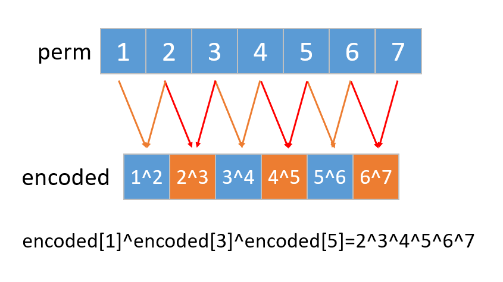

::: warning

给你 `encoded` 数组，请你返回原始数组。

:::

<!-- more -->

## 题目描述

### 解码异或后的数组I

未知 整数数组 arr 由 n 个非负整数组成。

经编码后变为长度为 n - 1 的另一个整数数组 encoded ，其中 encoded[i] = arr[i] XOR arr[i + 1] 。例如，arr = [1,0,2,1] 经编码后得到 encoded = [1,2,3] 。

给你编码后的数组 encoded 和原数组 arr 的第一个元素 first（arr[0]）。

请解码返回原数组 arr 。可以证明答案存在并且是唯一的。

> [1720. 解码异或后的数组](https://leetcode-cn.com/problems/decode-xored-array/)


### 解码异或后的数组II

给你一个整数数组 perm ，它是前 n 个正整数的排列，且 n 是个 奇数 。

它被加密成另一个长度为 n - 1 的整数数组 encoded ，满足 encoded[i] = perm[i] XOR perm[i + 1] 。比方说，如果 perm = [1,3,2] ，那么 encoded = [2,1] 。

给你 encoded 数组，请你返回原始数组 perm 。题目保证答案存在且唯一。

## 示例

### 解码异或后的数组I

```
输入：encoded = [1,2,3], first = 1
输出：[1,0,2,1]
解释：若 arr = [1,0,2,1] ，那么 first = 1 且 encoded = [1 XOR 0, 0 XOR 2, 2 XOR 1] = [1,2,3]

输入：encoded = [6,2,7,3], first = 4
输出：[4,2,0,7,4]
```

### 解码异或后的数组II

```shell
输入：encoded = [3,1]
输出：[1,2,3]
解释：如果 perm = [1,2,3] ，那么 encoded = [1 XOR 2,2 XOR 3] = [3,1]

输入：encoded = [6,5,4,6]
输出：[2,4,1,5,3]
```


## 提示

### 解码异或后的数组I

- `2 <= n <= 104`
- `encoded.length == n - 1`
- `0 <= encoded[i] <= 105`
- `0 <= first <= 105`


### 解码异或后的数组II

- `3 <= n < 105`
- `n` 是奇数。
- `encoded.length == n - 1`

## 解法

- 时间复杂度：$\mathcal{O}(n)$
- 空间复杂度：$\mathcal{O}(1)$


### 解码异或后的数组I

异或运算具有如下性质：

- 异或运算满足交换律和结合律；
- 任意整数和自身做异或运算的结果都等于 `0`；
- 任意整数和 `0` 做异或运算的结果都等于其自身。

由于 `arr[0]=first` 已知，因此对 `i` 从 `1` 到 `n−1` 依次计算 `arr[i]` 的值，即可解码得到原数组 `arr`。


```go
func decode(encoded []int, first int) []int {
    for i := range encoded {
        encoded[i], first = first, first ^ encoded[i]
    }
    encoded = append(encoded, first)
    return encoded
}
```


### 解码异或后的数组II

#### 计算数组全部元素的异或结果

重点看题目，有个关键性质：给你一个整数数组 `perm` ，**它是前 `n` 个正整数的排列**，且 `n` 是个 **奇数** 。

由于数组 `perm` 是前 `n` 个正整数的排列，因此数组 `perm` 的全部元素的异或运算结果即为从 `1` 到 `n` 的全部正整数的异或运算结果。用 `total` 表示数组 `perm` 的全部元素的异或运算结果，则有：`total = 1^2^3^...^n`


#### 计算数组除了首元素的全部元素的异或结果

`encoded`数组中所有`偶数位`（下标从`0`开始的，是奇数）元素的异或结果其实就是数组`perm`中**除第一个元素以外，其他所有元素异或的结果**。记为`odd`。



#### 计算数组首元素的值

知道了`total` 和 `odd` 两个结果，可以通过异或得到首元素的值：`first = total ^ odd`


实现代码如下：

```go
func decode(encoded []int) (res []int) {
    res = append(res, len(encoded) + 1)
    for i := range encoded {
        res[0] ^= (i + 1)
        if i & 1 == 1 {
            res[0] ^= encoded[i]
        }
    }

    for i := range encoded {
        res = append(res, res[i] ^ encoded[i])
    }

    return
}
```

