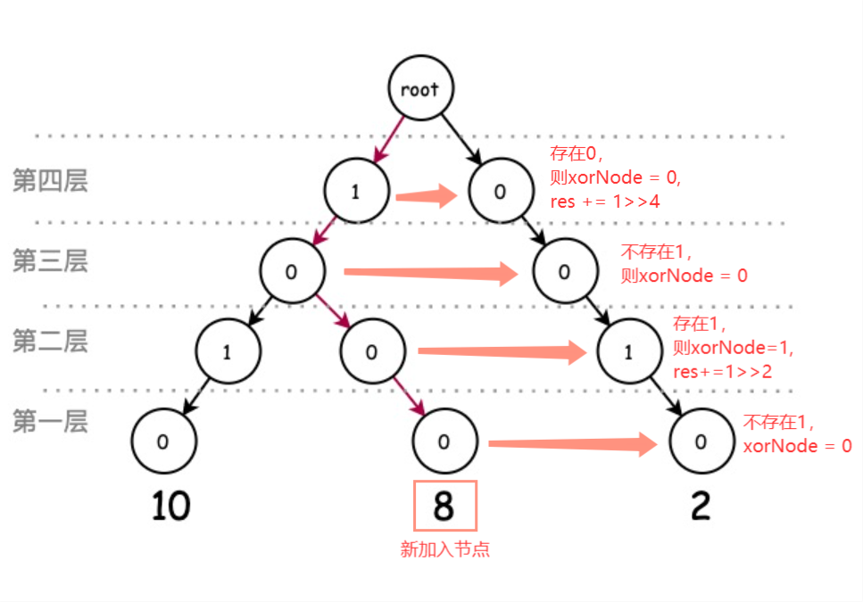

::: warning

返回数组中两个数的最大异或值。

:::

<!-- more -->

## 题目描述

给你一个整数数组 nums ，返回 nums[i] XOR nums[j] 的最大运算结果，其中 0 ≤ i ≤ j < n 。

进阶：你可以在 O(n) 的时间解决这个问题吗？

> [421. 数组中两个数的最大异或值](https://leetcode-cn.com/problems/maximum-xor-of-two-numbers-in-an-array/)


## 示例

```
输入：nums = [3,10,5,25,2,8]
输出：28
解释：最大运算结果是 5 XOR 25 = 28.

输入：nums = [0]
输出：0

输入：nums = [2,4]
输出：6

输入：nums = [8,10,2]
输出：10

输入：nums = [14,70,53,83,49,91,36,80,92,51,66,70]
输出：127
```


## 提示

- `1 <= nums.length <= 2 * 104`
- `0 <= nums[i] <= 231 - 1`

## 解法：Trie

我们分两步来解决这个问题：

1. 构建二进制前缀树
   具体来说就是利用数的二进制表示，从高位到低位构建一棵树（因为只有0和1 两个值，所以是一棵二叉树），每个从根节点到叶子节点的路径都表示一个数。

2. 搜索前缀树
   然后遍历数组中的数字，在每一层中，找到数字对应的`bit`的节点`node`与或的最大值节点`xorNode`，也就是：如果`bit=1`，找`bit = 0`的那条路径，如果是`bit = 0`，找`bit = 1`的那条路径，当前值的最大异或结果增加`res += 1 >> shift`。如果在相反位上找不到，则说明没有这个数，`xorNode`就设为与`bit`相同的位子节点。这样搜索下来的路径就是这个数字和整个数组与或的最大值。




```go
func findMaximumXOR(nums []int) (res int) {
    type Trie struct {
        child [2]*Trie
    }
    root := &Trie{}
    for i := range nums {
        node, xorNode, val := root, root, 0
        for shift := 31; shift >= 0; shift-- {
            bit := (nums[i] >> shift) & 1

            if node.child[bit] == nil {
                node.child[bit] = &Trie{}
            }
            node = node.child[bit]

            if xorNode.child[bit ^ 1] != nil {
                xorNode = xorNode.child[bit ^ 1]
                val += 1 << shift
            } else {
                xorNode = xorNode.child[bit]
            }
        }
        if val > res {
            res = val
        }
    }
    return
}
```