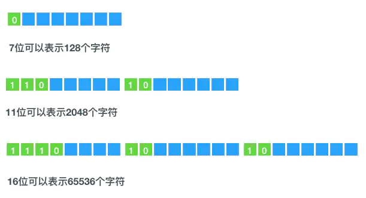

::: warning

Go语言中byte和rune实质上就是uint8和int32类型。byte用来强调数据是raw data，而不是数字；而rune用来表示Unicode的code point，string就是只读的采用utf8编码的字节切片(slice) 。

:::

<!-- more -->

rune 、 byte 和 string 都是 Go 的内置类型。Go语言中byte和rune实质上就是uint8和int32类型。byte用来强调数据是raw data，而不是数字；而rune用来表示Unicode的code point，string就是只读的采用utf8编码的字节切片(slice) 。

### 参考资料与工具

[在线utf8转换](https://link.juejin.cn/?target=https%3A%2F%2Fmothereff.in%2Futf-8) [String Data Type in Go](https://link.juejin.cn/?target=https%3A%2F%2Fmedium.com%2Frungo%2Fstring-data-type-in-go-8af2b639478) [byte vs string in Go](https://link.juejin.cn/?target=https%3A%2F%2Fsyslog.ravelin.com%2Fbyte-vs-string-in-go-d645b67ca7ff)

[Go系列string、bytes、rune的区别 ](https://juejin.cn/post/6844903743524175879)

### 计算机如何表示字符

计算机是二进制的，字符最终也是转换成二进制保存起来的。字符集就是定义字符对应的数值。 Unicode是一个字符集，为每个字符规定一个用来表示该字符的数字，但是并没有规定该数字的二进制保存方式，utf8规定了对于unicode值的二进制保存方式。

utf8是可变长度字符编码，不同的字符会对应不同大小的存储方式，比如"a"字符(unicode值97)用1个字节，而"中"字符(unicode值20013）则用3个字节。字符的unicode值决定了字符需要用多少字节表示





### 什么是string?

Go语言中，string就是只读的采用utf8编码的字节切片(slice) 。因此用len函数获取到的长度并不是字符个数，而是字节个数。 for循环遍历输出的也是各个字节。

```go
a := "Randal";
for i := 0; i < len(a); i++ {
 fmt.Printf("%x ", a[i])
 fmt.Printf("%c ", a[i])
}
// 输出结果
52 61 6e 64 61 6c
Randal
```

```go
a := "中国";
fmt.Println(len(a))
for i := 0; i < len(a); i++ {
 fmt.Printf("%x ", a[i])
}
for i := 0; i < len(a); i++ {
 fmt.Printf("%c ", a[i])
}

// 输出结果
6
E4 B8 AD E5 9B BD
中å½
```


fmt.Printf函数支持从一个表达式列表生成格式化的输出，它的第一个参数是格式化指示字符串，由它指定其他参数如何格式化。其中%c，用于输出字符(Unicode码点)，码点是字符的unicode值。 由于go采用的是utf8编码，而“中”的utf8编码是E4 B8 AD（所表示的unicode值是U+4E2D)， https://unicode-table.com/en/00E4/ 通过这个链接可以看到ä的unicode编码就是U+00E4。

从上面的例子中可以看出当字符的utf8编码超过1个字节的时候格式化输出单个字符就会出现乱码的情况，如果希望解决乱码问题就要用到rune了

### 什么是rune？

rune是int32的别名，代表字符的Unicode编码，采用4个字节存储，将string转成rune就意味着任何一个字符都用4个字节来存储其unicode值，这样每次遍历的时候返回的就是unicode值，而不再是字节了，这样就可以解决乱码问题了

```go
   var s string
   s = "中国"
   r := []rune(s)
   for i := 0; i < len(r); i++ {
     fmt.Printf("%x", r[i])
   }
   for i := 0; i < len(r); i++ {
     fmt.Printf("%c", r[i])
   }
  // 输出结果
  4e2d 56fd
  中国
```

通过for range对字符串进行遍历时，每次获取到的对象都是rune类型的，因此下面的方式也可以解决乱码问题

```go
   var s string
   s = "中国"
   for _, item := range s {
     fmt.Printf("%c", item)
   }
  // 输出结果
  中国
```

### 什么是bytes

bytes操作的对象也是字节切片，与string的不可变不同，byte是可变的，因此string按增量方式构建字符串会导致多次内存分配和复制，使用bytes就不会因而更高效一点

```go
 package main
 import (
   "fmt"
   "bytes"
 )
 func main() {
   var s string
   s = "中国"
   var b bytes.Buffer
   b.WriteString("中国")
   for i := 0; i < 10; i++ {
     s += "a"
     b.WriteString("a")
   }
   fmt.Println(s)
   fmt.Println(b.String())
 }
```

