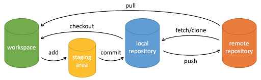

::: warning

这里总结一下我常用的git命令。

:::

<!-- more -->



## 场景操作
### 放弃本地所有未提交的修改
```bash
git checkout .  # 撤除本地没有提交的修改
git clean -df   # 删除当前目录下untrack文件和文件夹， 不包括.gitignore中指定的文件和文件夹
```
### 覆盖上次提交，并推送至远程分支（一般是自己的分支）
```bash
git add .
git commit -am --amend # 覆盖上次提交
git push -f # 强制推送到远程分支
```
### 获取远程分支代码
```bash
git fetch # 本地仓库记录远程分支的提交信息，并不会改变本地仓库文件
git merge # git fetch + git merge = git pull
```
### 和远程主分支保持同步（会少merge提交）
```bash
# 1.1拉取远程分支，rebase操作
git pull --rebase origin master 
### 产生冲突的话
git rebase --continue # 1.1.1本地开始手动解决冲突，和每一次master提价的冲突都需要解决
git rebase --abort # 1.1.2冲突太多，放弃解决冲突

# 1.2拉取远程分支，提merge
git pull origin master 
### 产生冲突的话
git merge --continue # 1.2.1本地开始手动解决冲突，只和master中最后一次提交解决冲突
git merge --abort # 1.2.2冲突太多，放弃解决冲突

# 2.提交到远程
git add . # 冲突已解决，把所有冲突文件add入分支中
git commit -am # 提交冲突解决
git push # 推送上远程仓库
```


## 常用指令
### 查看信息
```bash
git log # 查看各个有效commit的log信息
git reflog # 查看各个操作的commit_id
```
### 退回版本
```bash
git reset --hard HEAD^ # 不保留回退到上一个版本
git reset --hard commit_id  # 不保留未提交的修改
git reset --soft commit_id  # 默认方式，保留未提交的修改
```

### 撤除本地没有提交的修改
```bash
git checkout .
```
### 删除untrack files
```bash
git clean -f # 删除当前目录下untrack文件，不包括文件夹和.gitignore中指定的文件和文件夹
git clean -df # 删除当前目录下untrack文件和文件夹， 不包括.gitignore中指定的文件和文件夹
git clean -xdf # 删除当期目录下的所有untrack的文件和文件夹，慎用，因为会清楚`.idea`项目文件夹

### 显示会被删除的文件 ###
git clean -nxfd
git clean -nf
git clean -nfd
```
### 拉取最新代码
```bash
git pull --rebase origin master # 拉取origin master代码并且rebase本地分支
git pull 
```