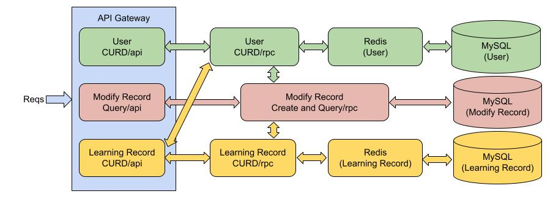

<!-- more -->

## 业务分析

| Method                   | HTTP request                                     | Description                              |
| ------------------------ | ------------------------------------------------ | ---------------------------------------- |
| **CreateLearningRecord** | **Post** /learning_record                        | 创建学习记录                             |
| **CreateUser**           | **Post** /user                                   | 创建用户                                 |
| **DeleteLearningRecord** | **Delete** /learning_record/{learning_record_id} | 删除学习记录                             |
| **DeleteUser**           | **Delete** /user/{user_id}                       | 删除用户                                 |
| **GetLearningRecords**   | **Get** /learning_records                        | 传入用户和课程列表，获取有关的学习记录。 |
| **GetUser**              | **Get** /user/{user_id}                          | 获取用户                                 |
| **GetModifyRecords**     | **Get** /modify_records                          | 获取修改记录                             |
| **UpdateLearningRecord** | **Put** /learning_record/{learning_record_id}    | 更新学习记录                             |
| **UpdateUser**           | **Put** /user/{user_id}                          | 更新用户                                 |

## 遇到的问题

### 系统可复⽤性 

> *实际业务中功能模块、场景⽐较多，常规做法是，每个查询都按需写查询各个微服务，这就忽略了系统的可复⽤性，譬如之前查询功能，都会⽤到查询⽤⼾等级，这个功能就是可复⽤的。 那么可设计系统框架：将这些操作变成"原⼦操作"，这些原⼦操作定义输⼊参数、输出参数，内部实现具体逻辑，他们是可以组装的，以此提⾼复⽤度，原⼦操作都是⾯向接⼝编程*

对于这个问题，我的理解是有意识在编码的时候将出现两次以上的中长逻辑片段以函数形式进行封装，提升系统的可复用性。

不是很理解原子操作、面向接口编程这两个概念。在我的了解中，原子操作一般指代数据库中事务的原子特性，测试驱动开发（TDD）优点类似面向接口这一概念，不过陷入不是思考中的“面向接口编程”。可能还是需要进入到实际的开发工作中，才能有更深入的理解。

在本层实现的课程Demo中，同一模块的重复逻辑通过函数封装提高可复用性，至于思考中的查询用户等级这一概念，我的实现是在API层直接调用GetUser这一RPC，因为这个服务可以提供查询等级的功能。为什么不选择在RPC层封装这一段逻辑，因为我将课程和用户分成了两个RPC，应该尽可能减少他们的复用代码，因为实际生产情况下这两个RPC服务有可能完全不会在同一环境中。

### 问题⾃动剖析系统 

> *借⽤上⾯框架，我们定义⼀些问题描述、输⼊参数，业务逻辑上借助各种可组装的"原⼦操作"，就可以达到伪智能问题剖析系统。*

这个问题是基于上个问题进行提出的，由于上个问题我没有能够理解原子操作的实现，所以也不是很理解“问题自动剖析系统”。

### Go-Zero Model层代码自动生成

> 在定义数据库时，课程记录应该与用户有一个外键相连，但是Go-Zero的goctl自动生成Model层代码出了问题：**它不支持含有符合键和外键的Model代码生成**。

在进行逻辑操作的时候，都需要查询判断外键关系，这应该是很大的消耗。不知道是因为我对这个工具理解有误，还是这个问题有别的解决方法。

### 事务的实现

>  因为修改记录这样Model不需要提供CURD的接口，所以就在RPC的逻辑层中直接操作了修改记录表。

不过这带来一点问题，修改记录应该是和两个表的修改操作应该是属于同一事务，没有对这两个操作进行事务的封装可能会导致修改记录不正确的问题。事务的实现又有以下的问题：

- 在go-zero自动生成的代码中，没看到事务的接口，是否需要手动实现。
- 如果这些Model处于不同的MySQL集群，该如何实现不同MySQL集群中的事务实现。

## 总结与思考

### 通用接口协议

> *是不是需要根据不同功能设计不同接⼝？如果有20个功能模块，每个模块提供CRUD，就要提 供80个接⼝，炸裂了。尝试设计⼀些通⽤协议吧*

**表现层状态转换**（**Representational State Transfer**，**REST**），REST对资源的操作包括获取、创建、修改和删除，这些操作正好对应HTTP协议提供的GET、POST、PUT和DELETE方法。

|                          资源                          |                             GET                              |                          PUT                          |                             POST                             |        DELETE        |
| :----------------------------------------------------: | :----------------------------------------------------------: | :---------------------------------------------------: | :----------------------------------------------------------: | :------------------: |
|   一组资源的URI，比如`https://example.com/resources`   | **列出**URI，以及该资源组中每个资源的详细信息（后者可选）。  |       使用给定的一组资源**替换**当前整组资源。        | 在本组资源中**创建/追加**一个新的资源。该操作往往返回新资源的URL。 |  **删除**整组资源。  |
| 单个资源的URI，比如`https://example.com/resources/142` | **获取**指定的资源的详细信息，格式可以自选一个合适的网络媒体类型（比如：XML、JSON等） | **替换/创建**指定的资源。并将其追加到相应的资源组中。 | 把指定的资源当做一个资源组，并在其下**创建/追加**一个新的元素，使其隶属于当前资源。 | **删除**指定的元素。 |

### 实现一次查询多个属性

> 在goctl自动生成的Model层操作代码，没有对指定列的查询操作提供接口，只有针对唯一键进行查询的接口。

经过查询更下一层的"go-zero.sqlc"库接口，发现了函数"QueryRowsNoCache"。在他的实现中，查询多行的操作时默认不查Cache的，可能是为了维护多值的数据一致性。

然后使用这个函数实现了根据多个列查询操作的接口`FindMultiple(userId int64, courseId int64) (*[]LearningRecord, error)`，但是这个接口每次只指定一个courseId，这会造成对多个courseId的查询，这对查询课程记录表来说是消耗巨大的。

最后研究了QueryRowsNoCache的代码实现，实现了一次可对多个courseId进行查询的接口`FindMultiple(userId int64, courseIds []int64) (*[]LearningRecord, error)`。

### 辅助工具使用

> 使用一些工具能够提升开发效率

- IDE：Goland
  - 代码补全，格式化，自动导入包
  - 有goctl的插件支持，可以在GUI使用goctl
  - 可视化运行多处api与rpc服务
- 接口调试：PostMan，api接口调试的辅助工具，替代命令行中curl的输入测试
- 文档生成：swagger，go-zero支持swagger接口文档自动生成

## Go-Zero 多RPC微服务开发流程

> 参考于：[GO-Zero 多RPC微服务demo](https://github.com/tal-tech/zero-doc/blob/main/docs/zero/bookstore.md)

Go-Zero构建多RPC微服务的流程主要分为以下几步：

0. 配置环境：

   1. 安装MySQL——实现数据持久化。

   2. 安装Redis——实现缓存机制。

   3. 安装ETCD——实现服务发现功能。
   4. 安装go-zero——微服务器框架
   5.  安装 goctl 工具——go-zero的代码自动生成工具

1. API模板生成：编写go-zero的API Gateway模板文件，使用 goctl 自动生成API Gateway代码。
2. RPC模板生成：编写基于protobuf 的 RPC模板文件，使用 goctl 自动生成RPC代码
3. Model数据库定义与相关操作代码生成：
   1. 定义数据库的sql文件，在MySQL中生成数据库及表格
   2. 根据数据库或者定义的sql文件，使用goctl自动生成CRUD+cache代码
4. RPC业务逻辑实现：
   1. 增加RPC连接MySQL与Redis的环境配置
   2. 完善RPC中的执行逻辑
5. 修改API Gateway代码调用 rpc服务：
   1. 增加RPC的连接配置
   2. 完善API业务中的执行逻辑

