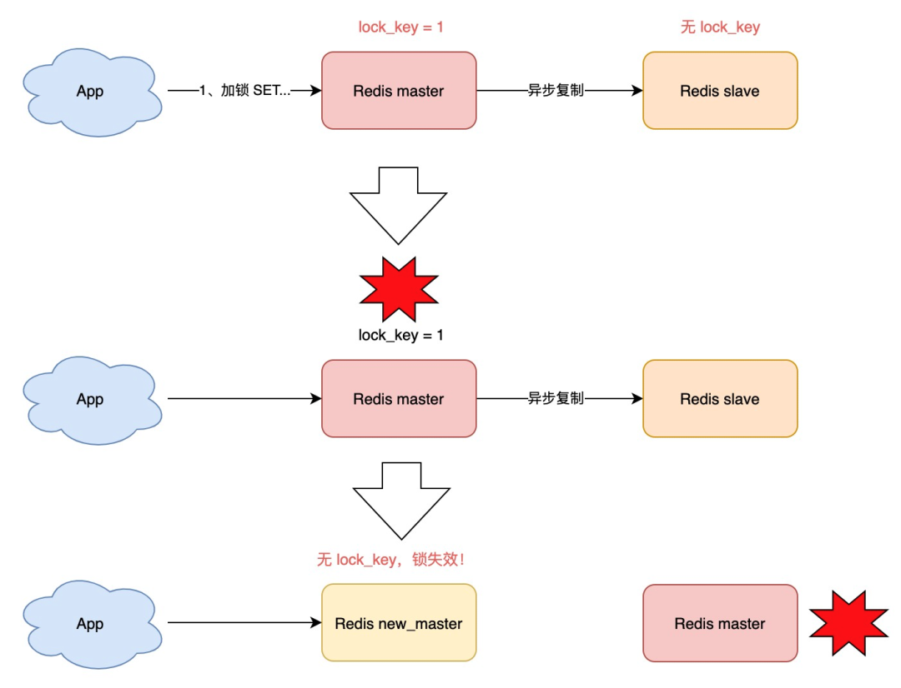

::: warning

对于现在的并发控制方案进行浅析。介绍了Redis的分布式锁以及Redlock方案。

:::

<!-- more -->

## 并发控制方案

先介绍一下现阶段并发系统中的多种并发控制方案。

| 方案                      | 形式                       | 应用场景   | 问题                             |
| ------------------------- | -------------------------- | ---------- | -------------------------------- |
| lock                      | 阻塞的拿锁                 | 单机场景   | 死锁                             |
| trylock                   | 非阻塞的拿锁               | 单机场景   | 活锁                             |
| 基于Redis的setnx          | 非阻塞的拿锁，锁持有设时限 | 分布式场景 | 可靠性不高                       |
| 基于ZooKeeper && 基于etcd | 阻塞的拿锁                 | 分布式场景 | 不适合高频次持锁时间短的抢锁场景 |

### 如何选择合适的方案

业务还在**单机**就可以搞定的量级时，那么按照需求使用任意的单机锁方案就可以。

如果发展到了**分布式服务阶段**，但**业务规模不大**，qps很小的情况下，使用哪种锁方案都差不多。如果公司内已有可以使用的ZooKeeper、etcd或者Redis集群，那么就尽量在不引入新的技术栈的情况下满足业务需求。

业务发展到一定量级的话，就需要从多方面来考虑了。

- 业务场景具有十分强的并发控制设定，极少数的极端场景造成的并发问题允不允许发生，如果不允许，那么就不要使用Redis的`setnx`的简单锁。
- 如果说业务具备高频次短时间的强锁场景，并且对极少数情况下的并发问题并不在意，使用Redis分布式锁会让整个业务的成本更低，实现也更加简单。

## Redis setnx分布式锁

对于Redis分布式锁，在一般的业务场景中十分常见，在这里就要浅析其原理，看看有什么地方需要注意的。

为什么说Redis分布式锁不完全可靠，因为它又以下几个问题，由简单到复杂我们进行分析：

1. **释放别人的锁**：发生了一些意外（比如说锁过期、主从切换等），客户端 1 以为自己仍持有锁，然后业务执行完把分布式锁释放了，这个时候释放的其实是客户端 2 的锁。
2. **锁过期**：客户端 1 操作共享资源耗时太久，导致锁被自动释放，之后被客户端 2 持有，但是客户端 1 仍认为自己持有锁。
3. **主从切换**：因为**主从复制是异步**的，那当「主从发生切换」时，分布式锁就有可能失效。

#### 释放别人的锁

**背景**：对于上文说的发生了一些意外，包含锁过期，导致客户端1 和 客户端 2 共同操作共享资源了，这个时候其实已经破坏了分布式锁的安全性了，但是如果这个时候客户端1释放了客户端2的锁，会造成客户端3进入共享资源，这就让这个问题更加严重了。

**解决方案**：对于这个方法，只要在上锁的时候设置一个UUID，在释放锁的时候判断目前的锁是不是之前持有的即可。**判断和释放这两个语句应该一并写入Lua脚本中**，保持两个语句的原子性。

**缺陷**：这个问题基本上是被解决了，唯一麻烦的点是还需要引入Lua脚本来保持语句的原子性。这里给我们一个启示，对于一些逻辑短小且不具有可扩展性的逻辑，可以考虑直接用Lua脚本来保证原子性。

#### 锁过期

**背景**：不设置过期时间可以从根本上解决这一问题，但是不设置过期时间会带来更严重的问题，比如说死锁、持有锁的线程dump了整个资源就不能访问了。所以setnx上锁设置过期时间是很有必要的。

**解决方案**：对于锁过期，解决的方法有：加锁时，先设置一个过期时间，然后我们开启一个「守护线程」，定时去检测这个锁的失效时间，如果锁快要过期了，操作共享资源还未完成，那么就自动对锁进行「续期」，重新设置过期时间。

**缺陷**：这个问题解决了，但是没有完全解决。这个守护线程的正确性需要验证，如果守护线程不能做到100%安全续期的话，锁过期问题也就不能说被完全解决。然而这种守护线程机制并没有被Redis提供。

#### 主从切换

**背景**：我们在使用 Redis 时，一般会采用**主从集群 + 哨兵**的模式部署。这样做的好处在于，当主库异常宕机时，哨兵可以实现「故障自动切换」，把从库提升为主库，继续提供服务，以此保证可用性。因为**主从复制是异步**的，那当「主从发生切换」时，分布式锁就有可能失效。除非不使用主从集群or哨兵模式，这和前面提到的setnx不设置过期时间是一样的道理。

**解决方案**：对于这个问题，Redis的作者[antirez (Salvatore Sanfilippo)](https://github.com/antirez)提出了Redlock方案。对于Redlock，将会再下文详细介绍。

**缺陷**：解决了，但是没有完全解决。Redlock仍然是不是绝对安全的，它牺牲了性能换取了主从同步问题的基本解决方案。但是牺牲了性能的Redis锁对比与ZooKeeper这类专门解决分布式锁的方案而言，还有多少优势可言呢？

## Redlock

### Redlock的设计

Redlock的用来解决Redis分布式锁对于主从切换造成的数据丢失问题，主要的设计思路是：

- 使用单实例模式来避免主从切换
- 使用多个单实例来增强单实例的可靠性
- 每次拿锁在多个实例之间进行一轮投票，民主决定锁的归属权

Redlock 的方案的设计是：**只**部署**5个以上**的完全独立的**主库**实例。这样基本保证他们不会同时都宕掉，获取锁和释放锁的过程中，客户端会执行以下操作:

### Redlock的争论

#### Martin的质疑

Redis 作者把这个方案一经提出，就马上受到业界著名的分布式系统专家**Martin Kleppmann**的**质疑**！主要的问题如下：

> Redlock方案比Redis原生方案更加臃肿，并且你的正确性也不能保证。为了效率用Redis就好，如果为了安全什么不用专门的分布式锁方案呢？

对于Redlock的不安全性，归纳为以下两点：

- **锁在分布式系统中会遇到的NPC问题**无法避免，任一问题都有可能造成Redlock的失效。这里以GC为例：
  - N：Network Delay，网络延迟
  - P：Process Pause，进程暂停（GC）
  - C：Clock Drift，时钟漂移

- **假设时钟正确的是不合理的**，在多个Redis节点中进行同步，这个方案的前台是确保每个Redis节点的时钟都是一致的，然而现实生活中很多情况都难以保证时钟的一致性。

额外的，Martin提出了另一个他认为合理的分布式一致性方案：

- **fecing token 的方案**，即客户端在获取锁时，锁服务可以提供一个「递增」的 token，客户端拿着这个 token 去操作共享资源，共享资源可以根据 token 拒绝「后来者」的请求。这样一来，无论 NPC 哪种异常情况发生，都可以保证分布式锁的安全性，因为它是建立在「异步模型」上的。

#### Antirez的反驳

对于Martin的问题，Antirez一一进行了回应。

- **锁在分布式系统中会遇到的NPC问题**：如果对方认为，发生网络延迟、进程 GC 是在步骤 3 之后，也就是客户端确认拿到了锁，去操作共享资源的途中发生了问题，导致锁失效，那这**不止是 Redlock 的问题，任何其它锁服务例如 Zookeeper，都有类似的问题，这不在讨论范畴内。**
- **假设时钟正确的是不合理的**：Redlock 并不需要完全一致的时钟，只需要大体一致就可以了，允许有「误差」。保证Redlock中大致一体的时钟，其实没有那么困难，只需要通过「恰当的运维」实际上这是可以做到的。

此外，Antirez还质疑 fencing token 机制：

- **质疑 fencing token 机制**：这个方案必须要求要操作的「共享资源服务器」有拒绝「旧 token」的能力。除了MySQL外，大部分要操作的资源服务器，都是没有这种互斥能力。既然资源服务器都有了「互斥」能力，那还要分布式锁干什么？

所以说Redlock具有比Redis 原始的分布式锁提供更可靠的保证，但是需要额外的时钟一致性运维消耗，并且具有更高的上锁消耗。在Redlock没有降低消耗或者解决人为运维成本的情况下，还是更倾向使用zookeeper此类专门的分布式一致性方案来保证敏感场景。

## 引用

1. [分布式锁· Go语言高级编程](https://books.studygolang.com/advanced-go-programming-book/ch6-cloud/ch6-01-lock.html)
2. [关于Redis RedLock算法的争论](https://www.shenyanchao.cn/blog/2018/12/28/argument-on-Redis/)
3. [How to do distributed locking — Martin Kleppmann's blog](https://martin.kleppmann.com/2016/02/08/how-to-do-distributed-locking.html)
4. [深度剖析：Redis分布式锁到底安全吗？看完这篇文章彻底懂了！](https://juejin.cn/post/6971240328581873701)
5. [基于Redis的分布式锁和Redlock算法 - 掘金](https://juejin.cn/post/6844904039218429960)
6. [Is Redlock safe?](http://antirez.com/news/101)

