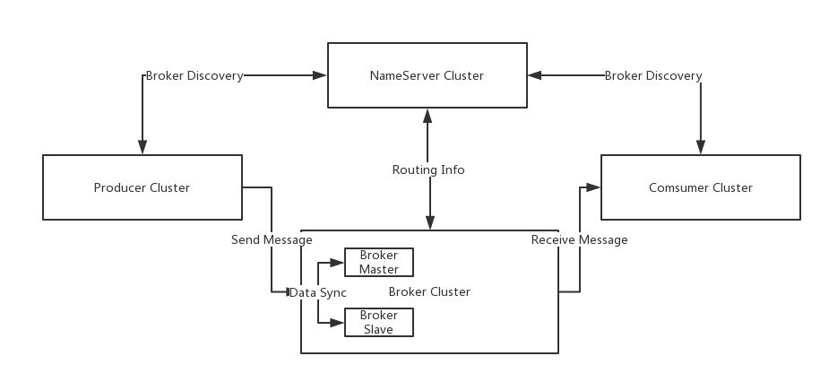

::: warning

Apache RocketMQ是一个分布式消息和流媒体平台，具有低延迟、高性能和可靠性、万亿级容量和灵活的可扩展性。

:::

<!-- more -->

## 概述

RocketMQ是一个分布式消息和流数据平台，具有低延迟、高性能、高可靠性、万亿级容量和灵活的可扩展性。

### 应用场景

- 削峰填谷 诸如秒杀、抢红包、企业开门红等大型活动时皆会带来较高的流量脉冲，或因没做相应的保护而导致系统超负荷甚至崩溃，或因限制太过导致请求大量失败而影响用户体验，消息队列RocketMQ版可提供削峰填谷的服务来解决该问题。
- 异步解耦
  交易系统作为淘宝和天猫主站最核心的系统，每笔交易订单数据的产生会引起几百个下游业务系统的关注，包括物流、购物车、积分、流计算分析等等，整体业务系统庞大而且复杂，消息队列RocketMQ版可实现异步通信和应用解耦，确保主站业务的连续性。
- 顺序收发 细数日常中需要保证顺序的应用场景非常多，例如证券交易过程时间优先原则，交易系统中的订单创建、支付、退款等流程，航班中的旅客登机消息处理等等。与先进先出FIFO（First In First
  Out）原理类似，消息队列RocketMQ版提供的顺序消息即保证消息FIFO。
- 分布式事务一致性 交易系统、支付红包等场景需要确保数据的最终一致性，大量引入消息队列RocketMQ版的分布式事务，既可以实现系统之间的解耦，又可以保证最终的数据一致性。
- 大数据分析 数据在“流动”中产生价值，传统数据分析大多是基于批量计算模型，而无法做到实时的数据分析，利用阿里云消息队列RocketMQ版与流式计算引擎相结合，可以很方便的实现业务数据的实时分析。
- 分布式缓存同步
  天猫双11大促，各个分会场琳琅满目的商品需要实时感知价格变化，大量并发访问数据库导致会场页面响应时间长，集中式缓存因带宽瓶颈，限制了商品变更的访问流量，通过消息队列RocketMQ版构建分布式缓存，实时通知商品数据的变化。

### 架构

RocketMQ由四部分组成：命名服务器（Name Server）、代理（Broker）、生产者（Producer）和消费者（Consumer），其中每一个都可以水平扩展而没有单点故障，如上图所示。

#### 命名服务器集群

命名服务器集群是用于服务发现的轻量级组件，它们可用于读取和写入路由信息。每个命名服务器可以记录全局信息，并支持快速存储扩展。

#### 代理集群

代理集群使用轻量级主题（topic）和队列（queue）机制来管理数据存储。为了实现容错，代理提供2份或3份数据。客户端可以在Push和Pull模型中获取消息。此外，还支持灾难恢复和丰富的指标统计信息。

#### 生产者集群

生产者（Producer）可以分布式部署，从生产者到代理的消息可以通过多路径进行平衡。此外，还支持快速故障恢复和低延迟。

#### 消费者集群

消费者也可以在Push和Pull模型中进行分布式部署，他们可以实时订阅消息，以集群为单位消费消息，同时还支持消息广播。

## 特点

它是纯Java开发，具有高吞吐量、高可用性、适合大规模分布式系统应用的特点。RocketMQ思路起源于Kafka，它对消息的可靠传输及事务性做了优化。（支持消息回放，支持事物消息）

1. 死信处理：将无法正常消费的消息春促到特殊的死信队列供后续处理。
2. 路由轨迹查询：NameServer提供详尽的路由信息，RocketMQ可以记录消息轨迹，能清晰定位消息从生产者发出，经由消息队列RocketMQ版服务端，投递给消息消费者的完整链路，方便定位排查问题。
3. 支持多种消息机制：
    1. 普通消息：消息队列RocketMQ版中无特性的消息，区别于有特性的定时和延时消息、顺序消息和事务消息。
    2. **事务消息**：实现类似XA或Open XA的分布事务功能，以达到事务最终一致性状态。
    3. **定时和延时消息**：允许消息生产者对指定消息进行定时（延时）投递，最长支持40天。
    4. **顺序消息**：允许消息消费者按照消息发送的顺序对消息进行消费，支持全局顺序消息和分区顺序消息。
4. 消息支持持久化存储，磁盘+内存混合模式：
   1. ASYNC_FLUSH ：在返回给 producer 写成功状态时，消息可能是写入了内存或写入了磁盘。当内存中的消息达到一定程度后，会统一刷盘，顺序写入。（适合于吞吐量优先） 
   2. SYNC_FLUSH ：在返回给 producer 写成功状态时，消息已经写入了磁盘。当消息写入内存时会立即告知刷盘线程刷盘，待刷盘成功后才会返回写成功状态。（可靠性优先）
5. 允许重置消费位点：根据时间或位点重置消费进度，允许用户进行消息回溯或者跳过堆积的消息从最新位点消费。
6. 支持消息重试：在消费者返回消息重试的响应后，消息队列RocketMQ版会按照相应的重试规则进行消息重投。
7. 至少投递一次（At-least-once）：消息队列RocketMQ版保证消息成功被消费一次。
8. 代理集群主从模式：备份消息，不易丢失。
9. 支持集群消费和广播消费两种消费模式：
   当使用集群消费模式时，消息队列RocketMQ版认为任意一条消息只需要被消费者集群内的任意一个消费者处理即可；当使用广播消费模式时，消息队列RocketMQ版会将每条消息推送给消费者集群内所有注册过的消费者，保证消息至少被每台机器消费一次。

## 引用

1. [消息队列RocketMQ版](https://help.aliyun.com/document_detail/29532.html)
2. [Apache RocketMQ](https://zh.wikipedia.org/wiki/Apache_RocketMQ)